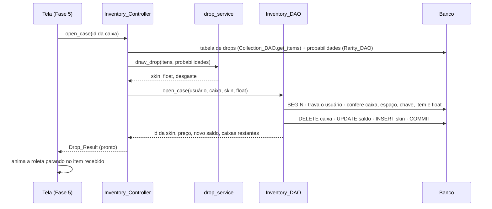
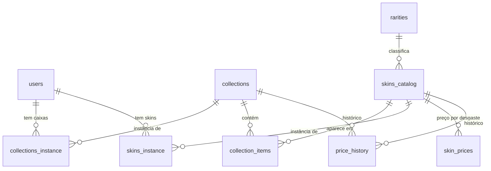

# CS Gacha — Roadmap v2 e Tutorial de Integração (Fases 2 a 5)

> Atualizado em **02/10/2026**. Substitui o roadmap de 01/10.
> Base: Documentação do Projeto, branch `refactoring` e as respostas às decisões D1–D12.
> **Estado conferido em 02/10, 22h:** Fases 4 e 5 validadas por você e no GitHub (`570efa8`): **MVP completo**. Os **extras** (seção 2.4) são feitos a partir desse commit, em pacotes pequenos: tutoriais na seção 10, depois das Fases 4 e 5. **Entregues:** Extras 1 (catálogo completo), **Extras 2** (busca, Ctrl+A, skin maior, compra múltipla e "Minha conta", que fecha o item 0 da documentação), **Extras 3** (português/inglês, com US$), **Extras 4** (Home viva e caixa grátis; precisa da migração 004) e **Extras 5** (CONFIGURAÇÕES, tela cheia, sons e música, cliques maiores).
> **Como usar:** siga as seções 7, 8 e 10 na ordem. Cada tarefa tem **Passos**, **Validação** (só marque `[x]` quando passar) e **Se der erro**. A seção 9 explica o código para você conseguir apresentar.

---

## Sumário

1. [Onde estamos](#1-onde-estamos)
2. [Decisões fechadas (D1–D9)](#2-decisões-fechadas-d1d9)
3. [Documentação × Projeto](#3-documentação--projeto-matriz-atualizada)
4. [Arquitetura](#4-arquitetura)
5. [O que mudou no banco (v1 → v2)](#5-o-que-mudou-no-banco-v1--v2)
6. [Arquivos entregues](#6-arquivos-entregues)
7. [Tutorial — Fase 2 (dados reais no banco)](#7-tutorial--fase-2-dados-reais-no-banco)
8. [Tutorial — Fase 3 (backend do gacha + nova tela de login)](#8-tutorial--fase-3-backend-do-gacha--nova-tela-de-login)
9. [Entendendo o código (para a apresentação)](#9-entendendo-o-código-para-a-apresentação)
10. [Fases 4 a 7 (tutorial das Fases 4 e 5)](#10-fases-4-a-7)
11. [Calendário](#11-calendário)
12. [PC do professor](#12-pc-do-professor)
13. [Riscos e plano B](#13-riscos-e-plano-b)
14. [Solução de problemas](#14-solução-de-problemas)
15. [Fontes](#15-fontes)

---

## 1. Onde estamos

| Fase | Conteúdo | Situação |
|---|---|---|
| 0 | Refatoração, ambiente | ✅ concluída (01/10) |
| 1 | Login e cadastro funcionando no banco | ✅ concluída (01/10) |
| 2 | Catálogo real (caixas, skins, raridades, floats) e preços reais no banco | ✅ catálogo e imagens (02/10) · 🟦 preços reais pela Steam: T2.4 passo 3 |
| 3 | Backend do gacha (sorteio, comprar, abrir, vender, inventário) + nova tela de login | ✅ validada no seu PC (02/10): testes, autoteste 31/31, login (com o Extras 4 o autoteste passa a ter 39 verificações) |
| 4 | Tela do Mercado (caixas e skins avulsas) | ✅ validada no seu PC e no GitHub (02/10, `570efa8`) |
| 5 | Inventário real, abertura com roleta, venda, detalhes | ✅ validada no seu PC e no GitHub (02/10, `570efa8`) |
| 6 | Home viva (animação), vitrine "equipar", Mirage otimizada | ✅ Mirage recortada e cenário carregando no login (correção 4, 02/10: T3.5) · ⏳ animação e vitrine (D12) |
| Extras | Pedidos de 02 e 03/10 (seção 2.4) | ✅ Extras 1 a 5 validados · 🟦 Extras 6 entregue (seção 10) |
| 7 | Testes de aceite, documentação, apresentação | ⏳ |
| — | Coletor de preços contínuo para o histórico (D10) | 🟦 **código pronto**: deixar rodando (T2.6) |

**Como o código das Fases 2 e 3 foi validado antes de chegar até você:**

- **Testes automáticos** (regras, sorteio, controllers, importador e login) passando: 67 nas Fases 2 e 3, 74 com as Fases 4 e 5.
- **Simulação de 200.000 aberturas:** cada raridade ficou a menos de 0,07 ponto percentual da chance oficial, e a distribuição de desgaste saiu em 3/24/33/24/16%.
- **Fluxo completo dos DAOs** rodado num banco de conferência gerado a partir do `schema.sql`: comprar, abrir, vender, comprar skin, preço que mudou, saldo insuficiente, inventário em 1.000, skin de outro jogador, rollback sem consumir a caixa e conexões sempre fechadas. 45 de 45 verificações passaram.
- **Importador** testado com os **dados reais da CSGO-API** vindos do seu PC (6 caixas, 355 skins, 0 avisos) e com a Steam simulada (19 de 19): preço real, item sem anúncio, limite de consultas, sem internet, Ctrl+C e retomada.
- **Tela de login** comparada com o seu mockup (prévia com as mesmas medidas e fontes) e a lógica dela exercitada com um Panda3D simulado (30 de 30).
- **Correção 4 (cenário no login + Mirage recortada):** o carregamento em segundo plano foi exercitado com um Panda3D simulado (46 de 46: modelos terminando fora de ordem, arquivo faltando ou corrompido, jogador entrando antes do fim, envio à placa de vídeo dividido em vários quadros). O mapa recortado foi conferido arquivo por arquivo e comparado com o original em 4 posições de câmera.

- **Fases 4 e 5 (telas):** desta vez eu compilei o **Panda3D 1.10 de verdade** aqui (com o renderizador por software dele) e rodei o **jogo inteiro** com um banco de conferência montado com o **catálogo real** (6 caixas, 389 skins, 1.430 anúncios) e um histórico de preços simulado. Resultado: **39 de 39** verificações de ponta a ponta (login, cadastro, comprar caixa e skin, busca, filtros, páginas, detalhes, venda, abertura com roleta, sem saldo para a chave, 15 trocas de tela sem sobrar widget/tarefa/evento, sair e entrar de novo, janela 4:3) e **prints de todas as telas**. Um revisor independente leu o código e os 4 problemas que ele achou foram corrigidos. **74 testes** automáticos passando.

- **Extras 2 (busca, Ctrl+A, skin maior, compra múltipla e Minha conta):** mesmo processo, com o jogo real aberto aqui. **84 testes** automáticos, **23 de 23** verificações do Extras 2 e **27 de 27** do Ctrl+A com **teclas de verdade** passando pela caixa de texto do Panda3D (setas, Home, End, Delete, Backspace, TAB, clique). As 39 de ponta a ponta das Fases 4 e 5 continuam passando. Um revisor independente leu o código; os pontos que ele achou (o principal: seta/Home/End com o texto marcado apagavam tudo) foram corrigidos e ganharam teste.
- **Extras 3 (português/inglês):** **97 testes** automáticos (13 novos; um deles lê o código e confere que **todo texto da tela tem tradução**, com os mesmos valores) e **35 de 35** verificações com o jogo real em inglês (login, cadastro, header, mercado, compra de 4 caixas, inventário, abertura, venda, Minha conta, volta ao português, troca de idioma 8 vezes sem sobrar nada, janela ultralarga). Todas as verificações em português continuam passando. Um revisor independente comparou o português antes e depois em 80.000 valores (dinheiro, chance, variação, float, data): **nenhuma diferença**. Os pontos que ele achou foram corrigidos.
- **Extras 4 (Home viva e caixa grátis):** **107 testes** automáticos, **40 de 40** verificações com o jogo real (Home com estatísticas e pedestal, modo wallpaper com a tecla H de verdade, caixa grátis da contagem até a abertura, destaque na Home, inglês, nada sobrando depois de 12 trocas de tela), **27 de 27** no banco de conferência (regra dos 10 minutos, inventário cheio, recusas sem gravar nada, estatísticas, destaque de outro jogador) e o autoteste do banco real com **39 de 39**. Um revisor independente achou 1 problema de verdade (o menu da caixa grátis podia reaparecer por cima da roleta) e alguns menores; o bug e os menores que afetam o jogador foram corrigidos e ganharam teste. **O que eu não consigo ver daqui:** o pedestal por cima do mapa real com o PBR (passo 5 do tutorial).
- **Extras 5 (CONFIGURAÇÕES, tela cheia, sons e cliques maiores):** **112 testes** automáticos e **32 de 32** verificações com o jogo real (cliques de verdade no alto do header, embaixo das abas e acima do link do login; cada opção das CONFIGURAÇÕES; F11; volumes; animações desligadas; os sons disparados em cada ação, contando os "tiques" da roleta). Todas as verificações dos Extras anteriores continuam passando. Um revisor independente conferiu áudio e tela cheia no código-fonte do Panda3D 1.10; os 2 problemas que ele achou (a busca do mercado continuava recebendo teclas com as CONFIGURAÇÕES abertas; F11 não atualizava o botão da janela aberta) foram corrigidos e ganharam teste. **O que eu não consigo ouvir nem ver daqui:** o som de verdade e a tela cheia no seu Windows (passos 3 e 5 do tutorial).
- **Extras 6 (skin 3D, pedestal da Mirage, volume fino, loop da música, personagem e poeira):** **115 testes** automáticos e **55 de 55** verificações com o jogo real: arrastar a barra de volume com o mouse de verdade, gravação só quando para de mexer, tag NA HOME seguindo a skin do pedestal, a peça 3D montada a partir do PNG, a inspeção girando com o mouse no Mercado e no inventário (e sumindo junto com a janela), o personagem preso no mapa com a câmera balançando, a poeira acompanhando a câmera e nada sobrando depois de várias trocas de tela. O arquivo da música foi conferido amostra por amostra (a emenda do loop fica contínua). Todas as verificações dos Extras anteriores continuam passando. Um revisor independente achou 5 pontos (o principal: o pedestal mudava o filtro de 4 texturas que o mapa também usa); todos foram corrigidos e ganharam teste. **O que eu não consigo ouvir nem ver daqui:** o som, o mapa com o PBR e o personagem de verdade (passos 3 a 5 do tutorial).

### 1.1 Próximos passos (na ordem)

1. **Extras 6** (seção 10): testes, checklist e commit. *Sem migração e sem biblioteca nova.*
2. Deixar o **coletor de preços** rodando (**T2.6**) no fim de semana.

> **O que eu NÃO consegui testar aqui:** a sua **placa de vídeo** (os prints daqui não têm o cenário 3D nem o PBR, e o renderizador por software deixa as imagens um pouco serrilhadas), o **MariaDB do XAMPP** e as **APIs reais**. Por isso cada fase tem o checklist visual no seu PC. Se algo falhar, copie a mensagem inteira e me mande.

---

## 2. Decisões fechadas (D1–D9)

Cada regra de jogo é **uma constante** em `app/core/game_rules.py`. Para mudar, altere só a linha indicada.

| # | Decisão | Como ficou | Onde muda |
|---|---|---|---|
| **D1** | Drops iguais ao CS | 1) sorteia a **raridade** entre as que existem **naquela caixa**: 79,92% / 15,98% / 3,20% / 0,64% / 0,26% (facas e luvas). Se a caixa não tem alguma raridade, as chances das outras são redistribuídas proporcionalmente. 2) sorteia a **skin**: dentro da raridade, todas têm chance igual. Uma mesma skin (ex.: as facas) pode estar em **várias caixas**: tabela `collection_items` (N:N). | probabilidades: tabela `rarities` |
| **D2** | Limite do inventário | **1.000 itens** (caixas + skins), o limite do CS. A compra é bloqueada com "Inventário cheio!". Abrir caixa continua permitido, porque sai 1 caixa e entra 1 skin (a regra do "−1" da documentação). | `INVENTORY_LIMIT` |
| **D3** | Mercado | Vende **caixas** e **skins avulsas**. Cada desgaste é um anúncio separado, como no mercado da Steam ("AK-47 \| Redline (Field-Tested)"). | — |
| **D4** | Preço real e volátil | Catálogo da **CSGO-API (ByMykel)** e preços **em R$** da **API pública do mercado da Steam** (`priceoverview`, a mesma usada pelo próprio mercado do CS). Preço = mediana das vendas das últimas 24 h ou, sem vendas no dia, o anúncio mais barato. Cada preço consultado atualiza o banco e entra uma linha em `price_history`. *(A Skinport foi descartada: ela bloqueia scripts com uma proteção anti-robô da Cloudflare.)* O jogo lê os preços **do banco**, então funciona **sem internet** na apresentação. Item sem preço na API recebe um **preço estimado** pela raridade e pelo desgaste. | `RARITY_BASE_PRICE`, `WEAR_PRICE_FACTOR` |
| **D5** | Float padrão do CS | Faixas oficiais: FN 0–0,07 · MW 0,07–0,15 · FT 0,15–0,38 · WW 0,38–0,45 · BS 0,45–1. Ao abrir uma caixa, o desgaste sai com **3% / 24% / 33% / 24% / 16%** (dados levantados pela comunidade; a Valve não publica a fórmula) e o valor é encaixado no float mínimo e máximo da skin. | `WEARS` |
| **D6** | Cortes | Fora do escopo: **EQUIPAMENTO, NOTÍCIAS, troca entre jogadores e gráficos avançados**. As armas padrão (do EQUIPAMENTO) continuam no catálogo como referência, mas **não entram mais no inventário** (no CS também não ocupam espaço). | — |
| **D7** (nova) | Chave para abrir caixa | No CS é preciso uma chave (US$ 2,49). Aqui custa **R$ 13,50**, cobrados na abertura. **Por quê:** sem a chave, abrir caixa dá lucro em média (o conteúdo vale mais que a caixa) e a economia quebra (persona José: "valor/custo consistente"). Para desligar: `Decimal("0.00")`. | `KEY_PRICE` |
| **D8** (nova) | Taxa de venda | **15%**, como a Steam. Uma skin de R$ 10,00 rende R$ 8,50. | `SELL_FEE_RATE` |
| **D9** (nova) | Login | O seu mockup tem o campo **"Usuário"**, então o login aceita **nome de usuário OU e-mail**: com "@" busca pelo e-mail, sem "@" busca pelo usuário. Por isso o nome de usuário não pode ter "@". | `Login_Controller.auth` |

### 2.1 Ideias de 02/10 (avaliadas)

| # | Ideia | Como fica | Por quê |
|---|---|---|---|
| **D10** | Histórico de mercado com gráfico e preços mais certos | **Coletor contínuo** (`--so-precos --continuo`) rodando o fim de semana inteiro no seu PC: cada passada (~1 h 20) grava um ponto novo de cada item em `price_history`. Em ~60 h são **~45 pontos por item**, de preço real da Steam. O gráfico entra no Mercado (Fase 4) desenhado com o próprio Panda3D (`LineSegs`), **sem biblioteca nova**. O banco já é o "arquivo" dos dados; não precisa de JSON intermediário. | **Várias instâncias ao mesmo tempo não aceleram:** a Steam limita por IP (cerca de 20 consultas por minuto). Duas instâncias dividem o mesmo limite e só fazem a Steam bloquear antes e por mais tempo. **Dois PCs da mesma casa também não:** a Steam enxerga o IP público da internet (o do roteador), não o da placa de rede, então os dois PCs contam como um só. A Steam tem um endpoint de histórico completo (`pricehistory`), mas ele exige o cookie de login da sua conta: isso contraria o "sem integração com a Steam" da documentação e arrisca a conta se o cookie vazar. **Descartado.** |
| **D11** | Telas mais fiéis ao CS2 + Mirage | As telas novas das Fases 4 e 5 (Mercado, Inventário, Abertura) **já nascem no estilo do CS2**: painéis escuros translúcidos, faixa de cor da raridade nos cards, tipografia e header no padrão da tela de login. Não vale refazer as telas antigas antes, porque elas vão ser substituídas. **Mirage:** eu otimizo o `de_mirage_d.glb`, recortando só a parte do mapa que a câmera do menu enxerga e reduzindo as 704 texturas. A meta é ficar abaixo de 100 MB no total, para **caber no Git** e carregar rápido no PC do professor. Não precisa me enviar: com a pasta liberada eu pego o arquivo direto. | Hoje o mapa tem 103 MB de geometria + 234 MB de texturas, e o Git recusa o arquivo. Carregar tudo isso num PC mais fraco é o maior risco de travar na apresentação. Para carregar `.glb` com animações de forma confiável, entra o `panda3d-gltf` (já listado como opcional no `requirements.txt`). |
| **D12** | Animação na Home e "equipar skin" | **Animação procedural**: câmera passeando devagar pelo cenário, o personagem com um leve movimento de respiração e balanço, e luz e poeira no ar. **Equipar:** no inventário, o botão EQUIPAR põe a skin numa **vitrine na Home** (imagem grande, nome, raridade, float), ao lado do personagem. **Bônus:** a AK-47 3D girando com a animação oficial de inspeção (`inventory_inspect`). | Os personagens `*_spawnpoint.glb` são **estátuas**: sem esqueleto e sem animações, com a arma "colada" no corpo. Animação de esqueleto não é possível neles. A **skin 3D real** na arma também não: a API só traz a imagem 2D de cada skin, e as texturas 3D (padrão + máscaras + desgaste) teriam de ser extraídas do jogo uma a uma. A vitrine entrega a mesma ideia ("minha skin em destaque na Home") com risco baixo. |

**Ordem de prioridade:** MVP (Fases 4 e 5, já no estilo CS2) → coletor rodando em paralelo (custo zero) → gráfico → Home viva (animação) → vitrine "equipar" → otimização da Mirage. Se o tempo apertar, os extras saem nessa ordem, de trás para frente.

### 2.3 Decisões das Fases 4 e 5 (padrão aplicado; me diga se quiser diferente)

| # | Pergunta | Padrão aplicado |
|---|---|---|
| **D13** | Mockup do grupo para Mercado e Inventário? | Sem mockup: estilo do CS2 (painéis escuros, faixa e brilho da cor da raridade, botões laranja como o ENTRAR). Se o grupo tiver um desenho, eu ajusto. |
| **D14** | "LOJA" ou "MERCADO" no menu? | **MERCADO** (nome da documentação). É só o texto em `MENU_ITEMS` (`game_view_base.py`). |
| **D15** | Filtros do inventário | **TUDO / CAIXAS / SKINS** (as outras categorias eram do escopo cortado, D6). |
| **D16** | Onde abrir caixa | **No Inventário**, como no CS2: clica na caixa → ABRIR CAIXA → roleta. No Mercado, a compra avisa que a caixa foi para o inventário. |

### 2.4 Extras pós-MVP (pedidos de 02/10, 21h18)

| # | Pedido | Decisão | Pacote |
|---|---|---|---|
| 0 | *(da documentação)* Ver e editar os dados da conta | Clicar no nome no header abre "Minha conta" | ✅ **Extras 2** (E2) |
| 1 | Comprar várias caixas/skins de uma vez | Quantidade na janela de compra (1 a 50), numa transação só | ✅ **Extras 2** (E2) |
| 2 | Todas as caixas e skins | **As 42 caixas + as skins das coleções de mapa** (estas só no mercado, porque não saem de caixa). 3 raridades novas (Consumer, Industrial, Contraband) pela migração 003 | ✅ **Extras 1** (E1) |
| 3 | Home viva | Janela flutuante com estatísticas (caixas abertas, valores movimentados...), skin em destaque num pedestal girando, câmera com leve movimento, tecla para esconder a interface (wallpaper) | ✅ **Extras 4** (E4) |
| 4 | Skin maior no mercado | Imagem maior no painel e clique para ampliar | ✅ **Extras 2** (E2) |
| 5 | Ctrl+A nos campos de texto | Ctrl+A marca tudo; a próxima tecla substitui e Backspace/Delete apagam | ✅ **Extras 2** (E2) |
| 6 | Busca melhor | Palavras em qualquer ordem ("ak inheritance", "ak-47 inheritance" e "ak47" acham a AK-47 \| Inheritance) | ✅ **Extras 2** (E2) |
| 7 | Caixa gratuita | Skins baratas + 1 rara (**5%**), sem chave. Aparece quando o saldo não paga a chave (< R$ 13,50), no máximo 1 vez a cada 10 min | ✅ **Extras 4** (E4) |
| 8 | Português e inglês | Troca de idioma no login e no header. Em inglês os valores aparecem em **US$**, convertidos por uma cotação definida em `game_rules.py` (o banco continua em R$) | ✅ **Extras 3** (E3) |
| 9 | Banco online | **Depois da apresentação** (decisão sua). Fazer do jeito seguro exige um servidor (API) entre o jogo e o banco | — |
| 10 | Instalador .exe | **Depois da apresentação** (decisão sua). Viável com o `build_apps` do Panda3D | — |
| 11 | *(03/10)* Cliques mais fáceis | A área clicável do menu do header vai da altura toda do header e um pouco para os lados; o mesmo nas abas, setas de página e links | ✅ **Extras 5** (E5) |
| 12 | *(03/10)* Configurações | **CONFIGURAÇÕES** no header, no lugar do PT \| EN (o login continua com PT \| EN). Dentro: Minha conta, idioma, **moeda** (Automática, que segue o idioma; R$; US$), sons e animações da Home. Fica salvo no PC, como o idioma | ✅ **Extras 5** (E5) |
| 13 | *(03/10)* Sons e música | Sons **CC0** (domínio público): [Interface Sounds, da Kenney](https://opengameart.org/content/interface-sounds) e [Main Menu Music (Loop)](https://opengameart.org/content/main-menu-music-loop). Liga/desliga e volume nas Configurações. Os sons da Valve ficaram de fora: a [política da Valve](https://developer.valvesoftware.com/wiki/Mod_Content_Usage) permite em fangame não comercial, mas num repositório público é zona cinzenta | ✅ **Extras 5** (E5) |
| 14 | *(03/10)* Tela cheia | JANELA / TELA CHEIA nas Configurações e atalho **F11**; a escolha fica salva no PC | ✅ **Extras 5** (E5) |
| 15 | *(03/10, 10h)* Skin 3D em vez do PNG girando | O PNG **não dá** para "vestir" o modelo 3D da arma (é uma foto da arma pronta, não a textura desembrulhada dela, e só temos o modelo da AK e da AWP). Feito: a própria imagem vira uma **peça sólida** (frente, verso e laterais) | 🟦 **Extras 6** (E6) |
| 16 | *(03/10, 10h)* Inspeção 3D como no CS | A skin 3D girando com o mouse na imagem ampliada do Mercado e no DETALHES do inventário (caixas continuam com a imagem plana) | 🟦 **Extras 6** (E6) |
| 17 | *(03/10, 10h)* Volume mais fino | Barra de arrastar de 1 em 1% com **curva** (o volume real é a porcentagem ao cubo) e − / + de 1%. Frações não fazem falta: com a curva, 1% na parte baixa já é um ajuste fino | 🟦 **Extras 6** (E6) |
| 18 | *(03/10, 10h)* Tag NA HOME automática | A tag segue a skin que **está** no pedestal (a escolhida ou, sem escolha, a mais valiosa); na automática o menu oferece **FIXAR NA HOME** | 🟦 **Extras 6** (E6) |
| 19 | *(03/10, 10h)* Música com corte no loop | O arquivo tinha 0,35 s de silêncio no começo e o começo de uma batida cortada no fim: recortado no ponto exato (46 compassos) e 8 dB mais baixo | 🟦 **Extras 6** (E6) |
| 20 | *(03/10, 10h)* Pedestal mais bonito | Texturas da **própria Mirage** que já estão no projeto: degrau de pedra, corpo e tampo de mármore e a faixa decorada das paredes | 🟦 **Extras 6** (E6) |
| 21 | *(03/10, 10h)* Personagem preso na câmera + animação | Agora fica preso no **mapa** (mesmo lugar de antes). O modelo exportado é a versão "spawnpoint", **sem ossos** (conferido: 0); a animação é uma **respiração e balanço leves por código**. Ossos de verdade: depois da apresentação | 🟦 **Extras 6** (E6) |
| 22 | *(03/10, 10h)* Partículas na Home | Poeira flutuando e névoa leve, por código, seguindo ANIMAÇÕES DA HOME | 🟦 **Extras 6** (E6) |

Ordem: 2 primeiro (para o coletor juntar histórico das caixas novas no fim de semana), depois 6, 5, 4, 1 e 0, depois 8 (antes dos itens 3 e 7, para eles já nascerem traduzidos), depois 3 e 7.

🟦 = entregue, falta você validar · ✅ = validado por você.

### 2.2 Regras novas a partir de agora

- ⚠️ **Nunca mais rode o `schema.sql` no seu PC**: ele apaga o banco **e o histórico de preços** coletado. Mudanças no banco passam a vir como **migração incremental** (`app/migrations/003_....sql`, só `ALTER TABLE`/`CREATE TABLE`), que preserva os dados.
- **Backup antes de qualquer migração** (cmd): `C:\xampp\mysql\bin\mysqldump -u root -p --databases csgacha > backup_csgacha.sql`.
- **Antes de extrair um ZIP: `git pull`** (principalmente se você usou o outro PC). Se o `git pull` der **conflito**, não escolha "Accept Both" / "Aceitar ambos": me mande a lista de arquivos antes de resolver. *(Foi o que quebrou o merge `cab847b`; ver Extras 4.)*
- **Ciclo de validação das telas:** eu não consigo abrir a janela do Panda3D aqui. Você roda e me manda print do que aparecer. *Opcional:* se no fim de semana você deixar o PC ligado com o app do Claude aberto e me der permissão de controle do computador, eu mesmo rodo o jogo e tiro os prints, o que acelera bastante os ajustes de tela.

**Moeda:** reais (R$), porque a Steam devolve os preços em BRL (`currency=7`). Saldo inicial R$ 500,00 (como antes).

**Fora do escopo por enquanto (Won't):** StatTrak™ (10% de chance no CS) e Souvenir. Dá para adicionar depois sem mudar a estrutura.

---

## 3. Documentação × Projeto (matriz atualizada)

Legenda: ✅ pronto · 🟦 pronto no backend (falta a tela) · ⏳ falta

| História da documentação | Backend | Banco | Tela |
|---|---|---|---|
| Criar conta (nome, e-mail, senha; e-mail único) | ✅ | ✅ | ✅ (novo layout) |
| Login | ✅ (usuário ou e-mail) | ✅ | ✅ (novo layout) |
| Ver/editar dados | ✅ `User_Controller.update` | ✅ | ⏳ (Could) |
| Cálculo de probabilidade (backend) | ✅ `drop_service` | ✅ | — |
| Abrir caixa: valida caixa, espaço (−1), "inventário cheio!", não consome se der erro | ✅ `Inventory_DAO.open_case` | ✅ | ⏳ Fase 5 |
| Mostrar só o resultado no front / abrir outra / aceitar | ✅ `Drop_Result` (`can_open_another`) | — | ⏳ Fase 5 |
| Salvar caixas não abertas e itens novos | ✅ | ✅ | — |
| Acessar mercado / ver itens / detalhes | ✅ `Market_Controller` | ✅ | ⏳ Fase 4 |
| Comprar: preço verde/vermelho, saldo, espaço, confirmação | ✅ `can_afford`, `check_purchase`, `buy_case`, `buy_skin` | ✅ | ⏳ Fase 4 |
| Ver inventário / não mostrar itens de outros | ✅ `Inventory_Controller.load` | ✅ | ⏳ Fase 5 |
| Detalhes do item (float, nome, desgaste) | ✅ `Skin_Instance.wear_label` etc. | ✅ | ⏳ Fase 5 |
| Saldo atualizado e nunca negativo | ✅ (transação + `CHECK`) | ✅ | 🟦 header já mostra |
| Vender com valor final e confirmação | ✅ `sale_quote`, `sell_skin` | ✅ | ⏳ Fase 5 |
| "Valores reais" (persona Douglas) | ✅ importador + histórico | ✅ | ⏳ Fase 4 |

---

## 4. Arquitetura

```
┌────────────┐   chama    ┌──────────────┐  usa   ┌──────────────────┐   SQL   ┌────────┐
│   VIEW     │ ─────────▶ │  CONTROLLER  │ ─────▶ │       DAO        │ ──────▶ │ BANCO  │
│ (Panda3D)  │ ◀───────── │ (regra da    │ ◀───── │ (acesso ao banco)│ ◀────── │MariaDB │
│ só desenha │ resultado  │  tela)       │        └──────────────────┘         └────────┘
└────────────┘            └──────┬───────┘                                         ▲
                                 │ usa                                              │
                          ┌──────▼───────┐                              ┌──────────┴──────┐
                          │    CORE      │                              │ tools/          │
                          │ game_rules   │                              │ sync_market.py  │
                          │ drop_service │                              │ (API → banco)   │
                          └──────────────┘                              └─────────────────┘
```

- **View**: só desenha e lê o que o jogador digitou/clicou. Nunca calcula nada.
- **Controller**: recebe a ação da tela, chama o sorteio e os DAOs, trata erros e devolve mensagem ou resultado.
- **Core**: regras puras do jogo (sem banco e sem tela), fáceis de testar.
- **DAO**: todo o SQL. O `Inventory_DAO` faz as operações de dinheiro e itens em **transação**.
- **tools/sync_market.py**: roda fora do jogo e alimenta o banco com dados reais.

**Fluxo de uma abertura de caixa** (o que a documentação pede: cálculo no backend, o front só recebe o resultado):



---

## 5. O que mudou no banco (v1 → v2)

| Mudança | Por quê |
|---|---|
| Banco em `utf8mb4` e tabelas `InnoDB` | Nomes de skins têm "★" e "™"; `InnoDB` é necessário para transações e `FOR UPDATE` |
| `skins_catalog.collection_id` **removida** → tabela nova **`collection_items`** (caixa N:N skin) | No CS a mesma faca aparece em várias caixas; com 1:N teríamos de duplicar skins |
| `api_id` e `market_name` em `collections` e `skins_catalog` | Ligam nossos registros à API (importar de novo sem duplicar) e ao nome no mercado (buscar o preço) |
| `rarities.color` | Cor da raridade na interface (azul, roxo, rosa, vermelho, dourado) |
| Tabela **`skin_prices`** (preço atual por skin + desgaste; colunas de média reservadas, a Steam não informa) | Cada desgaste tem preço diferente no mercado real |
| Tabela **`price_history`** | Histórico a cada atualização (variação, gráfico) |
| `collections.price_source` / `price_updated_at` | Saber se o preço é real (`steam`) ou `estimado`, e de quando é |
| `acquired_at` nas instâncias | Ordenar o inventário do mais novo para o mais antigo (como no CS) |
| `CHECK (balance >= 0)` e `ON DELETE CASCADE` | O banco também impede saldo negativo; excluir a conta apaga os itens dela (antes dava erro de chave estrangeira) |
| Seed: armas padrão **fora** do inventário do usuário de teste | EQUIPAMENTO foi cortado; no CS as armas padrão não ocupam o inventário |



---

## 6. Arquivos entregues

O ZIP espelha a estrutura do projeto: é só extrair **por cima** da pasta do projeto.

| Arquivo | Situação | O que é |
|---|---|---|
| `main.py` | ALTERADO | + janela 1280×720, título e `textures-power-2 none` (sem isso as imagens ficam borradas) |
| `README.md` | REESCRITO | O antigo estava em UTF-16 (o GitHub mostrava "C S - G a c h a"); agora UTF-8, com a instalação |
| `ROADMAP.md` | REESCRITO | Este documento |
| `requirements.txt` | ALTERADO | Comentários; **nenhuma biblioteca nova** (o `brotli` saiu com a Skinport) |
| `.gitignore` | ALTERADO | + `tools/cache/` |
| `app/migrations/schema.sql` | REESCRITO | Banco v2 (seção 5). **Apaga e recria o banco** |
| `app/migrations/seed_base.sql` | REESCRITO | Raridades com cor, usuário de teste, armas padrão |
| `app/core/paths.py` | NOVO | Caminhos das pastas em um lugar só |
| `app/core/game_rules.py` | NOVO | **Regras do jogo** (limite, chave, taxa, desgaste, preço estimado, formato R$) |
| `app/core/drop_service.py` | NOVO | **Sorteio**: tabela de drops, raridade, skin, float |
| `app/models/rarity.py` | NOVO | Raridade (nome, probabilidade, cor) |
| `app/models/collection.py` | NOVO | Caixa (nome, preço; `quantity` no inventário) |
| `app/models/skin_catalog.py` | NOVO | Ficha da skin (nome, raridade, float mínimo e máximo) |
| `app/models/skin_instance.py` | NOVO | Skin do jogador (float, desgaste, valor) |
| `app/models/market_price.py` | NOVO | Preço de mercado (atual, origem, data) |
| `app/models/drop_result.py` | NOVO | Resultado da abertura entregue à tela |
| `app/models/user.py` | ALTERADO | Nome de usuário não pode ter "@" (D9) |
| `app/dao/base_dao.py` | ALTERADO | + `Base_DAO` (conexão, cursor `buffered`) e `Read_Only_DAO` (catálogo). `DAO` continua igual para o `User_DAO` |
| `app/dao/user_dao.py` | ALTERADO | + `get_by_username` |
| `app/dao/rarity_dao.py` | NOVO | Lê raridades e probabilidades |
| `app/dao/collection_dao.py` | NOVO | Caixas, conteúdo (tabela de drops) e histórico |
| `app/dao/skin_catalog_dao.py` | NOVO | Skins, preços por desgaste, anúncios do mercado (busca e paginação) e histórico |
| `app/dao/inventory_dao.py` | NOVO | **Transações**: comprar caixa, abrir, comprar skin, vender; listar o inventário |
| `app/controller/login_controller.py` | ALTERADO | Login por usuário ou e-mail; mensagens novas |
| `app/controller/market_controller.py` | NOVO | Regras da tela do Mercado |
| `app/controller/inventory_controller.py` | NOVO | Regras do Inventário (abrir, vender) |
| `app/view/login_register_view.py` | REESCRITO | Tela no layout do mockup (login + cadastro) |
| `app/assets/ui/*` | NOVO | Fundo, campos, botão (4 estados) e ícones |
| `app/assets/fonts/*` | NOVO | Fonte Inter (Regular e Bold) + licença OFL |
| `tools/sync_market.py` | NOVO | **Importador** da API |
| `app/unit_tests/test_user_flow.py` | ALTERADO | Login por usuário ou e-mail |
| `app/unit_tests/test_gacha_rules.py` | NOVO | Testes de regras e sorteio |
| `app/unit_tests/test_gacha_controllers.py` | NOVO | Testes dos controllers |
| `app/unit_tests/test_sync_market.py` | NOVO | Testes do importador |
| `app/unit_tests/manual_gacha_flow.py` | NOVO | **Autoteste no banco real** |
| `erro_main.txt` | **APAGAR** | Não é erro: é a mensagem normal do Panda3D ao iniciar |

Arquivos **não alterados**: `view_manager.py`, `user_controller.py`, `database.py` (o seu `use_pure=True` foi mantido), `password_utils.py`, `home_view.py`, `inventory_view.py`, `game_view_base.py`, `scene_backdrop.py`, `tools/arma_view.py`, `tools/mapa_view.py` e o protótipo.

### 6.1 Correção 4 (02/10, tarde): cenário carregando no login + Mirage recortada

Entregue em **2 partes** (o arquivo único passava do limite de envio): `cs-gacha-correcao-4-parte1.zip` (código + `de_mirage_menu.glb`) e `cs-gacha-correcao-4-parte2.zip` (as 264 texturas do mapa). É **cumulativa** em relação ao commit `bad0600`: também traz as correções 2 e 3.

| Arquivo | Situação | O que é |
|---|---|---|
| `tools/sync_market.py` | ALTERADO (correções 2 e 3) | Preços pela **Steam** no lugar da Skinport (bloqueada pela Cloudflare), retomada, aviso `ATENÇÃO` só quando algo falhou de verdade e o modo `--continuo` (T2.6) |
| `app/unit_tests/test_sync_market.py` | ALTERADO (correções 2 e 3) | Testes da Steam e do modo contínuo |
| `app/core/game_rules.py` | ALTERADO (correção 2) | `SOURCE_API = "steam"` |
| `app/models/market_price.py` | ALTERADO (correção 2) | Comentário: a Steam não informa médias de 7/30 dias |
| `app/migrations/schema.sql` | ALTERADO (correção 2) | **Só comentários** (`'steam'` no lugar de `'skinport'`). **Não rode de novo** no seu PC (regra 2.2) |
| `README.md` | ALTERADO | Convertido para UTF-8 (o do GitHub ainda está em UTF-16) |
| `ROADMAP.md` | ALTERADO | Este documento |

### 6.2 Correção 5 (02/10, 17h50): respostas de erro fechadas

| Arquivo | Situação | O que é |
|---|---|---|
| `tools/sync_market.py` | ALTERADO | Fecha a resposta de erro da Steam (429, 500, 403...) depois de usar. Some o `ResourceWarning` do Python 3.14 na T3.1 |
| `app/unit_tests/test_sync_market.py` | ALTERADO | + teste que confere que as respostas de erro são fechadas (67 testes) |
| `ROADMAP.md` | ALTERADO | Este documento (dump do banco na 12.2 e ensaio na 12.1) |
| `app/assets/maps/mirage_menu/` | NOVO | **Mirage recortada** (265 arquivos, ~50 MB, contra 337 MB do original): só o que a câmera da Home enxerga (com folga para a animação da Fase 6), sem as malhas de ferramenta do editor e com texturas reduzidas (cor até 1024 px, detalhe até 512 px). **Vai no Git** (nenhum arquivo passa de 25 MB). |
| `app/view/scene_backdrop.py` | ALTERADO | Carrega mapa e personagem **em segundo plano** (`loadModel` com `callback`) e envia o cenário à placa de vídeo **aos poucos** enquanto o login está aberto. Usa a Mirage recortada; se ela não existir, cai no `de_mirage_d.glb` completo. |
| `app/view/login_register_view.py` | ALTERADO | Meio segundo depois de aparecer, pede o pré-carregamento do cenário (`TASK_PRECARREGAR`). |
| `app/view/home_view.py` | ALTERADO | Se o jogador entrar antes do fim, mostra **"Carregando cenário..."** até o mapa aparecer. |
| `requirements.txt` | ALTERADO | `panda3d-simplepbr` passa a ser instalado sempre: o `scene_backdrop.py` já usava, e sem ele o PC do professor mostraria o cenário com outra iluminação. |

---

### 6.3 Fases 4 e 5 (02/10, noite): Mercado, Inventário, venda e abertura

ZIP `cs-gacha-fases-4-5.zip`, feito a partir do seu commit `3d35974`.

| Arquivo | Situação | O que é |
|---|---|---|
| `app/view/ui_kit.py` | NOVO | Peças de interface no estilo CS2 usadas pelas telas novas: cartão de item, botões, abas, paginação, caixa de busca, janela (pop-up), aviso que some sozinho, barra de desgaste e o **gráfico de preços** (com `LineSegs`, sem biblioteca nova) |
| `app/view/market_view.py` | NOVO | **Mercado** (Fase 4): abas CAIXAS e SKINS, painel de detalhes, compra com confirmação, busca, filtros de raridade, páginas e ▲▼ de 24 h |
| `app/view/inventory_view.py` | REESCRITO | **Inventário** (Fase 5): itens reais, contador "x / 1.000", destaque + menu do item, pop-up de DETALHES, VENDER com valor final e confirmação |
| `app/view/case_opening.py` | NOVO | **Abertura de caixa** com a roleta (visual do protótipo do grupo, agora com as skins reais) |
| `app/view/game_view_base.py` | ALTERADO | Header: "MERCADO" no lugar de "LOJA", fonte Inter, item da tela atual sublinhado de laranja, saldo em R$ e `atualizar_saldo()` |
| `app/view/home_view.py` | ALTERADO | Só informa a rota (`ROTA = "home"`) para o header destacar |
| `app/view/login_register_view.py` | ALTERADO | **Correção de um erro meu:** a fonte Inter nunca carregava (o `loadFont` do Panda3D só aceita o caminho como texto e eu passava um `Filename`), então o login usava a fonte padrão. Agora usa a Inter de verdade, como no mockup |
| `app/controller/market_controller.py` | ALTERADO | + `price_changes()` (▲▼ da página inteira numa consulta) e `list_rarities()` (filtros) |
| `app/controller/inventory_controller.py` | ALTERADO | + `case_contents()` (prévia e cartões da roleta) |
| `app/dao/skin_catalog_dao.py` | ALTERADO | + `get_history_for_listings()`: últimos 60 pontos de cada anúncio da página (usa `ROW_NUMBER()`, do MariaDB 10.2+) |
| `app/core/game_rules.py` | ALTERADO | + `price_change()`: variação do preço em 24 h |
| `app/controller/view_manager.py` | ALTERADO | Guarda os DAOs que as telas novas usam |
| `main.py` | ALTERADO | Cria os DAOs e registra a rota `"shop"` (MERCADO) |
| `app/unit_tests/test_gacha_rules.py`, `test_gacha_controllers.py` | ALTERADOS | + 7 testes (74 no total) |
| `ROADMAP.md` | ALTERADO | Este documento |

## 7. Tutorial — Fase 2 (dados reais no banco)

### T2.1 Trazer os arquivos para o projeto (10 min)

**Passos**
1. Abra o terminal na pasta do projeto e confira que está tudo salvo:
   ```bat
   cd caminho\do\CS-Gacha
   git checkout refactoring
   git pull
   git status
   ```
   `git status` precisa dizer *nothing to commit, working tree clean*. Se não disser, faça commit do que tem antes.
2. Extraia o ZIP **por cima** da pasta do projeto: botão direito no `cs-gacha-fase2-3.zip` → **Extrair tudo...** → em *Destino*, **apague o final `\cs-gacha-fase2-3`** e deixe só a pasta do projeto (ex.: `C:\...\CS-Gacha`) → **Extrair** → **Substituir os arquivos no destino**. Por padrão o Windows cria uma subpasta, e aí os arquivos não entram no projeto. Depois de extrair, `main.py` e `README.md` devem estar na mesma pasta de antes, e não dentro de `cs-gacha-fase2-3\`.
3. Apague o log que foi para o Git por engano:
   ```bat
   git rm erro_main.txt
   ```
4. Veja o que mudou:
   ```bat
   git status
   ```

**Validação**
- [ ] `git status` mostra os arquivos da tabela da seção 6 (modificados e novos) e `erro_main.txt` como *deleted*.
- [ ] Existem as pastas `app/assets/ui` (12 arquivos) e `app/assets/fonts` (3 arquivos).

### T2.2 Instalar a dependência nova (2 min)

**Passos**
```bat
.venv\Scripts\activate
pip install -r requirements.txt
```
Nenhuma biblioteca nova é necessária. Se você instalou o `brotli` na versão anterior, pode remover: `pip uninstall brotli`.

**Validação**
- [ ] `python -c "import panda3d, mysql.connector, dotenv; print('ok')"` imprime `ok`.

### T2.3 Recriar o banco na versão 2 (10 min)

> ⚠️ O `schema.sql` **apaga** o banco `csgacha` e cria de novo. As contas criadas nos testes de ontem somem (o usuário `testes` volta pelo seed).

**Passos (DBeaver)**
1. Ligue o MySQL no painel do XAMPP.
2. No DBeaver, conecte como `root`, abra `app/migrations/schema.sql` e execute **o script inteiro** com **Alt+X** ("Executar script"). Ctrl+Enter executa só uma linha.
3. Abra `app/migrations/seed_base.sql` e execute com **Alt+X**.
4. Se o DBeaver estiver em modo de *commit manual*, clique em **Commit**.

*Alternativa (phpMyAdmin):* aba **Importar** → escolha o arquivo → **Executar**. Se aparecer "DROP DATABASE statements are disabled", apague o banco antes em *Operações → Remover o banco de dados* e importe de novo.

**Validação** (rode no DBeaver):
```sql
use csgacha;
show tables;                                   -- 9 tabelas
select name, probability, color from rarities; -- 5 linhas; soma = 1.0000
select username, email, balance from users;    -- testes | teste@teste.com | 500.00
select count(*) from skins_catalog;            -- 34 (armas padrão)
select count(*) from skins_instance;           -- 0  (o inventário começa vazio)
```
- [ ] Tudo igual aos comentários acima.

**Se der erro:** "Access denied" no jogo depois disso → o usuário do `.env` perdeu a permissão. Rode como root:
```sql
grant all privileges on csgacha.* to 'csgacha_app'@'localhost';
flush privileges;
```
(troque `csgacha_app` pelo usuário do seu `.env`; se você usa `root` no `.env`, não precisa).

### T2.4 Importar caixas, skins e preços reais (catálogo 5 min + preços ~1 h 20)

> **Se você já fez a T2.4 com a versão anterior (Skinport):** o catálogo e as imagens já estão certos no seu banco. Depois de extrair a correção 4 (que traz a troca para a Steam), rode **só** a etapa de preços (passo 3) ou já deixe a T2.6 rodando.

**Passos**
1. Veja os nomes das caixas disponíveis (opcional):
   ```bat
   python tools/sync_market.py --listar
   ```
2. Importe as caixas padrão **com as imagens**:
   ```bat
   python tools/sync_market.py --imagens --sem-precos
   ```
   As caixas padrão são: *CS:GO Weapon Case, Chroma Case, Glove Case, Fracture Case, Dreams & Nightmares Case, Kilowatt Case*. Para trocar, edite a lista `CAIXAS_PADRAO` no topo de `tools/sync_market.py` ou use `--caixas "Nome 1" "Nome 2"`. Todo item já fica com um **preço estimado**, então o jogo funciona a partir daqui.
3. Busque os **preços reais** na Steam:
   ```bat
   python tools/sync_market.py --so-precos
   ```
   - A Steam responde **um item por vez** e aceita cerca de 20 consultas por minuto, por isso o script espera 3,2 s entre elas. Para as 6 caixas são ~1.436 preços: **cerca de 1 h 20**.
   - A ordem foi pensada para o jogo: primeiro as **caixas**, depois as skins **mais comuns** (as que mais saem nas aberturas) e por último facas e luvas. Em **~25 min** as caixas e as ~420 skins de armas já estão com preço real.
   - Pode deixar rodando num terminal enquanto você trabalha em outra coisa.
   - **Ctrl+C para a qualquer momento sem perder nada:** o progresso é salvo a cada 10 itens, e rodar `--so-precos` de novo continua do que falta.
   - Se a Steam pedir uma pausa (HTTP 429), o script espera 65 s sozinho. Depois de 3 pausas seguidas ele para e salva, e aí é só rodar de novo depois de uns 10 minutos.
   - Para rodar em partes: `python tools/sync_market.py --so-precos --limite 300`.

**O que você vai ver** no passo 3 (os números variam):
```
1/4 Catálogo: pulado (--so-precos).
2/4 Gravação do catálogo: pulada.
3/4 Consultando 1436 preços em R$ no mercado da Steam (~77 min).
    Pode interromper com Ctrl+C a qualquer momento: o progresso fica salvo e
    a próxima execução continua do que falta.
  [10/1436] P90 | Grim (Battle-Scarred): R$ 1,05  (faltam ~79 min)
  [20/1436] ...
    1402 preços reais gravados | 34 sem anúncio na Steam | 0 falhas de rede
4/4 Imagens: pulado (use --imagens para baixar).

Pronto!
```
"Sem anúncio" é normal: alguns itens raros não têm nenhum à venda naquele momento e continuam com o preço estimado.

**Validação** (DBeaver):
```sql
-- 1) caixas, preço e quantidade de itens
select c.name, c.price_collection, c.price_source, count(ci.skin_catalog_id) as itens
from collections c left join collection_items ci on ci.collection_id = c.id
group by c.id, c.name, c.price_collection, c.price_source;

-- 2) quantos itens de cada raridade numa caixa
select r.name, count(*) as itens
from collection_items ci
join skins_catalog s on s.id = ci.skin_catalog_id
join rarities r on r.id = s.rarity_id
where ci.collection_id = (select id from collections where name = 'Chroma Case')
group by r.name;

-- 3) origem dos preços (depois da etapa da Steam, a maioria deve ser 'steam')
select source, count(*) from skin_prices group by source;

-- 4) histórico gravado
select count(*) from price_history;
```
- [ ] A saída da etapa de preços **não** tem `! Parou antes do fim` nem o aviso `ATENÇÃO`. Se tiver, me mande a linha inteira: ela traz o motivo exato.
- [ ] 6 caixas, todas com itens e `price_source = steam`. O preço da caixa fica **diferente** de 5,00, que é o valor estimado.
- [ ] A consulta 2 mostra as 5 raridades (ou menos, se a caixa não tiver alguma).
- [ ] A consulta 3 mostra principalmente `steam` (o resto, `estimado`, são itens sem anúncio).
- [ ] A pasta `app/assets/items` tem as imagens `.png` (361 com as caixas padrão).
- [ ] Rodar o importador **de novo** não duplica nada (repita a consulta 1) e o `price_history` cresce.

**Se der erro:** veja a seção 14.

### T2.5 Commit (2 min)

```bat
git add -A
git commit -m "Fase 2: banco v2, catalogo e precos reais via API, importador"
git push
```
- [ ] Push sem erro. As imagens de `app/assets/items` vão juntas: assim o PC do professor não precisa baixá-las.

---

### T2.6 Deixar o coletor de preços rodando no fim de semana (D10)

**Passos**
1. Em **Configurações do Windows > Sistema > Energia**, deixe o computador **sem suspender** (tela pode desligar).
2. Deixe o **MySQL do XAMPP ligado**.
3. Num terminal separado (com o `.venv` ativo), rode e deixe aberto:
   ```bat
   python tools/sync_market.py --so-precos --continuo
   ```
   Ele faz uma passada completa (~1 h 20), espera 5 min e começa outra. Se a Steam limitar, espera 15 min; se a internet cair, espera 5 min e continua sozinho. **Ctrl+C** encerra sem perder nada.
4. Pode trabalhar no projeto ao mesmo tempo (jogo, testes e autoteste usam o mesmo banco sem conflito). Só **não rode o `schema.sql`** (regra 2.2).

**Validação** (DBeaver, depois de algumas horas):
```sql
-- pontos de histórico por item (deve crescer a cada passada)
select s.name, h.wear, count(*) as pontos, min(h.price) as minimo, max(h.price) as maximo
from price_history h join skins_catalog s on s.id = h.skin_catalog_id
group by s.name, h.wear order by pontos desc limit 20;

-- histórico das caixas
select c.name, count(*) as pontos, min(h.captured_at), max(h.captured_at)
from price_history h join collections c on c.id = h.collection_id group by c.name;
```
- [ ] O número de pontos cresce a cada passada.
- [ ] As linhas `=== Passada N` aparecem no terminal com horário.

## 8. Tutorial — Fase 3 (backend do gacha + nova tela de login)

### T3.1 Testes automáticos (2 min)

**Passos** (na raiz do projeto, com o `.venv` ativo):
```bat
python -m unittest app.unit_tests.test_user_flow app.unit_tests.test_gacha_rules app.unit_tests.test_gacha_controllers app.unit_tests.test_sync_market
```
**Validação**
- [ ] Termina com `Ran 74 tests` (eram 67 antes das Fases 4 e 5) e `OK`, sem nenhum traceback e sem `ResourceWarning` no meio.

> Até a correção 4 apareciam 3 avisos `ResourceWarning: Implicitly cleaning up <HTTPError ...>` no Python 3.14: o importador não fechava as respostas de erro da Steam (429, 500 e 403). Não era falha de teste, mas era conexão ficando aberta; a correção 5 fecha essas respostas e tem um teste para isso.

> O teste `test_erro_inesperado_nao_derruba_a_tela` simula o banco caindo de propósito. Ele captura o log do erro com `assertLogs`, para o traceback não aparecer na saída como se fosse uma falha.

### T3.2 Autoteste no banco real (3 min)

**Passos**
```bat
python -m app.unit_tests.manual_gacha_flow
```
O script cria um usuário temporário, compra uma caixa, abre, vende, compra uma skin avulsa e testa saldo insuficiente, chave e inventário cheio. Depois mostra **10.000 sorteios simulados** comparados com as chances oficiais e apaga o usuário temporário.

**Validação**
- [ ] Última linha: `TUDO CERTO: 31 verificações passaram.` (o número pode variar um pouco).
- [ ] A tabela "esperado × obtido" mostra valores próximos. **Guarde um print para a apresentação.**
- [ ] Os preços do autoteste são reais: a caixa usada **não** custa R$ 5,00 e a skin do drop não custa exatamente o valor estimado (ex.: Mil-Spec FN = R$ 1,28; Special Item BS = R$ 1.125,00). Se custarem, os preços estão estimados: volte à T2.4.
- [ ] A linha "Desgaste" não precisa bater com 3/24/33/24/16%: cada skin tem float mínimo e máximo próprios, e o valor é encaixado nesse intervalo. Uma skin de 0,00 a 0,50, por exemplo, nunca sai Battle-Scarred.
- [ ] `select username from users;` mostra só as contas reais (o `autoteste_...` sumiu).

**Se der erro:** mande a saída **inteira**. A lista "FALHARAM" diz exatamente qual regra quebrou.

### T3.3 Conferir a nova tela de login (5 min)

**Passos**
```bat
python main.py
```
**Validação** (marque cada um):
- [ ] Janela 1280×720 com o fundo da arte, nítido, e o formulário embaixo do logo, igual ao mockup.
- [ ] O cursor já começa no campo **Usuário**, com borda laranja.
- [ ] Os textos de exemplo "Usuário" e "Senha" somem ao digitar e voltam ao apagar.
- [ ] **TAB** passa para o próximo campo; **Shift+TAB** volta.
- [ ] O **olho** mostra e esconde a senha.
- [ ] O botão **ENTRAR** muda de cor ao passar o mouse e ao clicar.
- [ ] Entrar com `testes` / `teste123` vai para a Home e mostra o saldo. Entrar com `teste@teste.com` também funciona.
- [ ] Senha errada mostra **"Usuário ou senha inválidos."** em vermelho.
- [ ] **Registrar** mostra 3 campos (Usuário, E-mail, Senha) e o botão **CADASTRAR**.
- [ ] Cadastro com senha curta mostra o erro; cadastro válido volta ao login com o usuário preenchido e a mensagem verde.
- [ ] Redimensionar ou maximizar a janela mantém o formulário alinhado ao logo.
- [ ] **SAIR** na Home volta ao login.

**Se algo estiver diferente:** tire um print e mande junto com o que apareceu no terminal (avisos começando com `WARNING` dizem qual imagem ou fonte não carregou).

### T3.4 Commit e tag (2 min)

```bat
git add -A
git commit -m "Fase 3: drop, transacoes de compra/abertura/venda, controllers e nova tela de login"
git push
git tag marco-3-backend
git push --tags
```
- [ ] Push sem erro.

### T3.5 Correção 4: cenário carregando no login + Mirage recortada (10 min)

**Passos**
1. Extraia **as duas partes** da correção 4 **por cima** do projeto (mesmo esquema da T2.1: em *Destino*, apague o final com o nome do ZIP). A ordem não importa. Confira:
   - `app\assets\maps\mirage_menu\` tem **265 arquivos**: o `de_mirage_menu.glb` (~23 MB) e 264 imagens;
   - `git status` mostra **11 arquivos alterados** e a pasta nova `app/assets/maps/mirage_menu/`.
2. Com o `.venv` ativo:
   ```bat
   pip install -r requirements.txt
   python main.py
   ```
3. Fique uns **10 segundos** na tela de login (é quando o cenário carrega) e depois entre.

**Validação**
- [ ] A tela de login aparece na hora e **não engasga** enquanto você digita.
- [ ] No terminal aparece `Cenário enviado à placa de vídeo em X s` (sinal de que o pré-carregamento terminou).
- [ ] Ao clicar em **ENTRAR**, a Home abre **sem travar**, com a Mirage e o personagem, no mesmo enquadramento de antes.
- [ ] Entrando **rápido** (logo que a janela abre), a Home mostra **"Carregando cenário..."** e o mapa aparece sozinho em seguida, sem congelar a janela.
- [ ] **SAIR** → login → entrar de novo: a Home abre instantaneamente (o cenário fica carregado).
- [ ] *(opcional)* Para o jogo usar só o mapa novo, renomeie temporariamente o `de_mirage_d.glb` e confira que tudo continua igual.

**Commit**
```bat
git add -A
git commit -m "Precos pela Steam, coletor continuo, cenario 3D carregado no login e Mirage recortada"
git push
```
- [ ] Push sem erro (são ~50 MB; pode levar alguns minutos).

**Se der erro:** mande o print e o terminal inteiro. Se a Home ficar em "Carregando cenário..." para sempre, procure no terminal por `Asset não encontrado` ou `Não foi possível carregar`.

---

## 9. Entendendo o código (para a apresentação)

### 9.1 O sorteio (`app/core/drop_service.py`)

1. **Tabela de drops**: `Collection_DAO.get_items(id)` traz todas as skins da caixa com a raridade de cada uma, que é a "tabela [item : probabilidade]" da documentação. `drop_table()` mostra a chance real de cada item.
2. **Raridade**: `draw_rarity()` usa `random.choices(raridades, weights=probabilidades)`. Os pesos são relativos, então se a caixa não tem alguma raridade as outras são redistribuídas sozinhas.
3. **Skin**: `random.choice()` entre as skins da raridade sorteada, com chance igual para todas.
4. **Float**: `draw_float()` sorteia a faixa (3/24/33/24/16%), um valor dentro dela de 0 a 1 e encaixa: `mínimo + valor × (máximo − mínimo)`.

Exemplo para explicar: numa caixa com 2 skins Covert, cada uma tem 0,64% ÷ 2 = **0,32%**.

### 9.2 Por que transação (`app/dao/inventory_dao.py`)

Abrir uma caixa mexe em 3 tabelas: apaga a caixa, desconta a chave e insere a skin. Se o programa caísse no meio, sem transação o jogador perderia a caixa sem ganhar a skin. Com transação, ou **tudo** é salvo (`commit`) ou **nada** (`rollback`). `SELECT ... FOR UPDATE` trava a linha do jogador até o fim, então duas operações ao mesmo tempo não gastam o mesmo dinheiro.

### 9.3 Por que `Decimal` e não `float`

`0.1 + 0.2` em `float` dá `0.30000000000000004`. Dinheiro e float da skin usam `Decimal`, igual ao `DECIMAL(10,2)` do banco.

### 9.4 Como o preço é "real"

O `tools/sync_market.py` monta o nome de mercado de cada item ("AK-47 | Redline (Field-Tested)"), consulta o **mercado da Steam** em R$ e grava no banco a mediana das vendas das últimas 24 h (ou o anúncio mais barato). Ele respeita o limite da Steam (uma consulta a cada 3,2 s), salva o progresso e continua de onde parou. O jogo só lê o banco: rápido e sem depender de internet. Cada preço consultado gera uma linha de histórico.

### 9.5 Perguntas prováveis da banca

| Pergunta | Resposta curta |
|---|---|
| Por que DAO? | Separa o SQL do resto. Se trocar de banco, só os DAOs mudam. |
| Como impede saldo negativo? | Três camadas: o controller confere, o DAO confere dentro da transação e o banco tem `CHECK (balance >= 0)`. |
| E se der erro no meio da abertura? | `rollback`: a caixa não é consumida (regra da documentação). Testado no autoteste. |
| O sorteio é justo? | Mesmas chances oficiais do CS. Mostre a tabela esperado × obtido do autoteste. |
| A tela calcula alguma coisa? | Não. A tela recebe um `Drop_Result` pronto e só anima. |
| Como a senha é guardada? | Hash SHA-256 com *salt* aleatório; a senha nunca fica salva em texto. |
| De onde vêm as skins? | CSGO-API (dados do jogo) e mercado da Steam (preços em R$), importados pelo `sync_market.py`. |
| E sem internet? | O jogo funciona: os dados já estão no banco. |

---

## 10. Fases 4 a 7

### Tutorial — Fases 4 e 5 (Mercado, Inventário e abertura) · 30 min

**Passos**
1. Extraia `cs-gacha-fases-4-5.zip` **por cima** do projeto (mesmo esquema da T2.1). Confira com `git status`: aparecem os arquivos da seção 6.3 (3 novos em `app/view` e os alterados).
2. Testes (com o `.venv` ativo):
   ```bat
   python -m unittest app.unit_tests.test_user_flow app.unit_tests.test_gacha_rules app.unit_tests.test_gacha_controllers app.unit_tests.test_sync_market
   ```
   - [ ] `Ran 74 tests` e `OK`.
3. `python main.py`, entre com o seu usuário e siga os checklists abaixo. Se o saldo acabar durante os testes, coloque mais pelo DBeaver: `update users set balance = 1000 where username = 'testes';` (depois saia e entre de novo).

**T4: Mercado** (botão **MERCADO** no header)
- [ ] O header mostra INVENTÁRIO · HOME · MERCADO, com a tela atual sublinhada de laranja e o saldo em R$ (ex.: `R$ 500,00`).
- [ ] Aba **CAIXAS**: as 6 caixas com imagem, nome e preço em **verde** (o saldo dá) ou **vermelho** (não dá). A primeira já vem selecionada (borda laranja).
- [ ] Painel da direita: imagem, preço da Steam com "atualizado em ...", **▲▼ em 24 h** (aparece quando o coletor já tem pontos), **gráfico do histórico** e o conteúdo por raridade **somando 100,00%**.
- [ ] **VER TODOS OS ITENS** mostra todos os itens com a chance de cada um (◀ ▶ para as páginas). FECHAR ou ESC fecha.
- [ ] **COMPRAR** → janela "Deseja comprar ... por R$ X?". **ENTER** confirma e **ESC** cancela. Depois de comprar, o saldo do header diminui e aparece o aviso verde embaixo.
- [ ] Com o saldo menor que o preço: "Saldo insuficiente." em vermelho e a janela não abre.
- [ ] Aba **SKINS**: 24 anúncios por página. Cada desgaste é um anúncio, como no mercado da Steam. Cada cartão mostra o preço e o ▲▼ de 24 h.
- [ ] Digitar "AK" na busca filtra sozinho em meio segundo (ENTER também busca). Os filtros Mil-Spec / Restricted / Classified / Covert / ★ Especiais funcionam junto com a busca.
- [ ] Mudar de página: ◀ ▶, **roda do mouse** ou as setas do teclado (fora da caixa de busca).
- [ ] No painel da skin, os botões **FN / MW / FT / WW / BS** trocam o desgaste (preço, faixa de float e gráfico mudam).
- [ ] Comprar uma skin: o aviso mostra o **float sorteado**, e ele está dentro da faixa do desgaste escolhido.

**T5: Inventário** (botão **INVENTÁRIO**)
- [ ] Contador "x / 1.000" no canto e só os seus itens. Caixas repetidas aparecem **uma vez com "x3"**. Filtros **TUDO / CAIXAS / SKINS**.
- [ ] Clicar numa skin: ela **cresce um pouco** e ganha borda laranja, e aparece o menu **DETALHES** / **VENDER · R$ X** (o X já é o valor final, com a taxa descontada). Clicar de novo ou ESC desmarca.
- [ ] **DETALHES**: pop-up grande com nome, raridade, desgaste, **float com 9 casas**, barra de desgaste com o marcador, preço de mercado, quanto você recebe, data em que obteve. FECHAR ou ESC fecha.
- [ ] **VENDER**: janela com preço de mercado − taxa de 15% = **você recebe**. Ao confirmar, o item some, o saldo sobe e aparece o aviso verde.

**T5: Abertura de caixa**
- [ ] Clicar numa caixa → **ABRIR CAIXA**: tela da roleta com os itens possíveis (facas e luvas juntas num cartão dourado "★", como no CS2) e o botão **ABRIR CAIXA · chave R$ 13,50**.
- [ ] **ABRIR** (ou ENTER): a roleta gira uns 6 segundos e para **no marcador laranja**, em cima do item ganho. Clique na roleta ou **ESPAÇO** para pular.
- [ ] O resultado mostra o item, a raridade, o desgaste, o float e o valor. O saldo do header diminuiu R$ 13,50.
- [ ] **ABRIR OUTRA** só aparece se ainda houver caixa igual (mostra quantas restam). **VER DETALHES** abre o pop-up do item. **ACEITAR** (ou ENTER) volta ao inventário, com a caixa a menos e a skin nova.
- [ ] Com saldo menor que a chave: "Saldo insuficiente para a chave (R$ 13,50)." e a caixa **não** é consumida.

**Commit**
```bat
git add -A
git commit -m "Fases 4 e 5: Mercado, Inventario, venda e abertura de caixa com roleta"
git push
git tag marco-5-mvp
git push --tags
```
- [ ] Push sem erro.

**Se der erro:** mande o print e o terminal inteiro. Os erros do banco aparecem no terminal com a linha exata.

### Extras 1 — Catálogo completo: 42 caixas + coleções de mapa (item 2) · 20 min + downloads

ZIP `cs-gacha-extras-1.zip`, feito a partir do seu commit `570efa8`.

| Arquivo | Situação | O que é |
|---|---|---|
| `app/migrations/003_raridades_colecoes.sql` | NOVO | Cria as raridades Consumer Grade, Industrial Grade e Contraband (chance 0: elas não saem de caixa). Não apaga nada |
| `app/migrations/seed_base.sql` | ALTERADO | As mesmas 3 raridades, para bancos novos (ex.: PC do professor) |
| `tools/sync_market.py` | ALTERADO | Nova opção `--colecoes`: também importa as skins que não saem de caixa (só para o mercado) |
| `app/core/game_rules.py` | ALTERADO | Raridades novas, ordem das raridades na tela e preço estimado delas |
| `app/controller/market_controller.py` | ALTERADO | Filtros de raridade na ordem do jogo (da mais comum para a mais rara) |
| `app/view/market_view.py` | ALTERADO | Aba CAIXAS com 4 x 3 caixas por página; filtros de raridade numa linha própria (são 9 agora) |
| `app/unit_tests/test_sync_market.py`, `test_gacha_controllers.py` | ALTERADOS | + 3 testes (77 no total) |

Números (conferidos com os JSON da API que vieram do seu PC): **42 caixas, 2.126 skins** (1.305 que saem de caixa + 821 de coleções) e **cerca de 9.300 anúncios**. Por isso a passada do coletor sobe de ~1h20 para **~8 h**. Itens novos têm prioridade: em uma noite todos ganham preço real.

**Passos**
1. Pare o coletor de preços (**Ctrl+C** no terminal dele; o progresso fica salvo).
2. Extraia o ZIP por cima do projeto.
3. Migração 003 (uma vez só), no **cmd**:
   ```bat
   C:\xampp\mysql\bin\mysql -u root -p < app\migrations\003_raridades_colecoes.sql
   ```
   *(ou abra o arquivo no DBeaver e execute como script, Alt+X)*
   - [ ] A conferência no fim mostra **8 raridades**.
4. Importe o catálogo completo e as imagens (sem preços; uns 5 min por causa das ~1.800 imagens novas):
   ```bat
   python tools/sync_market.py --todas --colecoes --imagens --sem-precos
   ```
   - [ ] Termina com "Pronto!" e mostra `Gravando 42 caixas e 2126 skins` e `+ 821 skins de coleções`.
5. Testes: `python -m unittest app.unit_tests.test_user_flow app.unit_tests.test_gacha_rules app.unit_tests.test_gacha_controllers app.unit_tests.test_sync_market`
   - [ ] `Ran 77 tests` e `OK`.
6. `python main.py` → MERCADO:
   - [ ] Aba CAIXAS: 12 caixas por página, **4 páginas**, todas com imagem.
   - [ ] Aba SKINS: 9 filtros (Todas, Consumer, Industrial, Mil-Spec, Restricted, Classified, Covert, Contraband, ★ Especiais). "Consumer" mostra skins de coleção (ex.: AUG \| Colony).
   - [ ] O inventário e as caixas antigas continuam iguais (nada se perdeu).
7. Volte a ligar o coletor: `python tools/sync_market.py --so-precos --continuo`
   - [ ] A primeira passada mostra cerca de 9.300 preços (~8 h).
8. Commit (as imagens novas vão junto, ~90 MB; o push demora um pouco):
   ```bat
   git add -A
   git commit -m "Extras 1: catalogo completo (42 caixas + colecoes de mapa)"
   git push
   ```

**Se der erro:** "Raridades ausentes no banco: {'Consumer Grade', ...}" → a migração 003 não rodou (passo 3).

### Extras 2 — Busca, Ctrl+A, skin maior, compra múltipla e "Minha conta" (itens 6, 5, 4, 1 e 0) · 25 min

ZIP `cs-gacha-extras-2.zip`, feito a partir do seu commit `570efa8`. **Sem migração e sem biblioteca nova.**

> **Ordem dos ZIPs:** faça o **Extras 1 antes** (migração 003 e importação). Este ZIP também traz os arquivos do Extras 1 (ele é feito a partir do `570efa8`), então extrair os dois não dá problema, **desde que o do Extras 2 seja o último**.

| Arquivo | Situação | O que é |
|---|---|---|
| `app/dao/skin_catalog_dao.py` | ALTERADO | **Busca por palavras** (`search_filters`): cada palavra precisa aparecer no nome, em qualquer ordem; hífen e espaço não atrapalham ("ak47" acha "AK-47") |
| `app/dao/inventory_dao.py` | ALTERADO | `buy_case(..., quantity)` e `buy_skins(...)`: **várias unidades numa transação só** (tudo ou nada; `executemany`) |
| `app/controller/market_controller.py` | ALTERADO | Quantidade de **1 a 50 por compra** (conferida antes de ir ao banco), `max_quantity()` (limite, saldo e espaço livre) e `buy_skins()` (cada unidade com o seu float) |
| `app/controller/user_controller.py` | ALTERADO | `update()` só muda os dados da sessão **depois** que o banco aceita (e-mail de outra conta não aparece no header por engano) |
| `app/view/account_window.py` | NOVO | Pop-up **MINHA CONTA**: nome, e-mail, nova senha (opcional) e saldo |
| `app/view/game_view_base.py` | ALTERADO | O nome no header vira botão (fica laranja com o mouse em cima) e abre "Minha conta" |
| `app/view/ui_kit.py` | ALTERADO | `SelecionarTudo` (**Ctrl+A**) e limite de letras nas caixas de texto (o mesmo das colunas do banco) |
| `app/view/login_register_view.py` | ALTERADO | Ctrl+A nos campos do login e do cadastro |
| `app/view/market_view.py` | ALTERADO | Janela de compra com **quantidade** (− / + / MÁX e setas ↑↓), **imagem maior** no painel com **clique para ampliar**, Ctrl+A na busca |
| `app/view/inventory_view.py` | ALTERADO | ESC, ENTER, ESPAÇO, setas e roda do mouse não agem por baixo do "Minha conta" |
| `app/unit_tests/test_gacha_controllers.py`, `test_user_flow.py` | ALTERADOS | + 7 testes (84 no total) |
| `ROADMAP.md` | ALTERADO | Este documento |

**Passos**
1. Extraia o ZIP por cima do projeto (depois do Extras 1).
   - [ ] Existe o arquivo novo `app/view/account_window.py`.
2. Testes: `python -m unittest app.unit_tests.test_user_flow app.unit_tests.test_gacha_rules app.unit_tests.test_gacha_controllers app.unit_tests.test_sync_market`
   - [ ] `Ran 84 tests` e `OK`.
3. `python main.py` → **login (Ctrl+A)**:
   - [ ] Digite algo no usuário e aperte **Ctrl+A**: aparece um fundo laranja atrás do texto. Digite uma letra: fica **só a letra**.
   - [ ] Ctrl+A e **Backspace** (ou **Delete**): apaga tudo.
   - [ ] Ctrl+A e **←** (ou **Home** / **End**): o texto **continua** e só o fundo laranja some. Clicar na caixa ou apertar TAB também desmarca.
   - [ ] Na senha também funciona (marca os ****).
4. Entre e vá ao **MERCADO → SKINS (busca e imagem)**:
   - [ ] Pesquise `ak inheritance`, depois `ak-47 inheritance` e `inheritance ak47`: aparece **só a AK-47 | Inheritance** (um cartão por desgaste).
   - [ ] Na busca, Ctrl+A + Backspace limpa o texto.
   - [ ] A imagem do painel da direita está **maior**. Clique nela: abre a imagem grande; clique, ENTER ou ESC fecham.
5. **Compra múltipla**:
   - [ ] Aba CAIXAS → COMPRAR: a janela mostra **QUANTIDADE** com − / + / **MÁX (n)**; as setas **↑↓** também mudam. O **Total** = preço × quantidade e o botão diz "COMPRAR 4x" (por exemplo).
   - [ ] Confirme 4 caixas: mensagem "4x ... comprada!", o saldo do header desconta 4 vezes e o Inventário mostra a caixa com **x4** (ou +4 se já tinha).
   - [ ] Aba SKINS → compre **3** unidades de uma skin: entram 3 itens no Inventário e o **DETALHES** de cada um mostra um **float diferente** (todos dentro do desgaste comprado).
   - [ ] Com pouco saldo, **MÁX** para no que o saldo paga.
6. **Minha conta** (item 0 da documentação: "visualizar e editar seus dados"):
   - [ ] Passe o mouse no seu nome no header (fica laranja) e clique: abre **MINHA CONTA** com nome, e-mail e saldo.
   - [ ] Troque o e-mail para o de **outra** conta e SALVAR: mensagem vermelha "Erro: E-mail já cadastrado." e o header **não** muda.
   - [ ] Troque o **nome** e SALVAR (ou ENTER): mensagem verde e o header mostra o nome novo.
   - [ ] Digite uma **nova senha** e SALVAR: a senha some da caixa. SAIR → entre com a senha nova: funciona. *(Salvar com a senha em branco mantém a atual.)*
   - [ ] No **Inventário**, selecione um item, abra "Minha conta" e aperte **ESC**: fecha só a janela; o item continua selecionado.
7. Commit:
   ```bat
   git add -A
   git commit -m "Extras 2: busca por palavras, Ctrl+A, skin ampliada, compra multipla e Minha conta"
   git push
   ```

**Como explicar na apresentação**
- **Busca:** o texto vira uma condição por palavra (`nome LIKE %palavra%`), todas obrigatórias. Uma segunda comparação tira hífen e espaço do nome (`REPLACE`) para "ak47" achar "AK-47". Tudo com parâmetros (`%s`), sem montar SQL com o texto do usuário.
- **Compra múltipla:** é a mesma transação da compra de uma unidade, só que com N linhas (`executemany`). Se qualquer coisa falhar (saldo, espaço, preço mudou), nada é gravado (rollback).
- **Ctrl+A:** a caixa de texto do Panda3D não tem seleção. O jogo guarda que o texto está "marcado" e desenha o fundo laranja; a próxima letra troca o texto inteiro. Detalhe técnico: a caixa avisa "digitou" também quando o cursor anda (setas), e só a tecla de uma letra vem com o código da tecla; é isso que separa "substituir" de "só desmarcar".
- **Minha conta:** a janela é só a "view"; a validação (e-mail, nome sem "@", senha com hash) é a mesma do cadastro, no `User_Controller`.

**Se der erro:** mande o print e o terminal inteiro. Se só a busca falhar com erro de SQL perto de `REPLACE`, mande também a versão do banco (`select version();`).

### Extras 3 — Português e inglês, com US$ (item 8) · 20 min

ZIP `cs-gacha-extras-3.zip`, feito a partir do seu commit `570efa8` (já traz os Extras 1 e 2: **extraia depois deles**). **Sem migração e sem biblioteca nova.**

| Arquivo | Situação | O que é |
|---|---|---|
| `app/core/i18n.py` | NOVO | O "motor" dos idiomas: `t("texto em português")` devolve o texto no idioma atual; troca e guarda o idioma escolhido; números e datas no formato de cada idioma |
| `app/core/i18n_en.py` | NOVO | As traduções para o inglês (o texto em português é a chave) |
| `app/core/game_rules.py` | ALTERADO | `format_money` mostra **US$** em inglês, convertendo pela cotação `BRL_PER_USD = 5.22` (dólar comercial de 01/10/2026); nomes de desgaste no idioma ("Testada em Campo" / "Field-Tested") |
| `app/view/login_register_view.py` | ALTERADO | Textos traduzidos e **PT \| EN** embaixo do formulário |
| `app/view/game_view_base.py` | ALTERADO | Menu e SAIR traduzidos e **PT \| EN** no header, antes do SAIR |
| `app/view/ui_kit.py` | ALTERADO | `seletor_idioma()` (o PT \| EN), abas traduzidas, números com vírgula ou ponto |
| `app/view/market_view.py`, `inventory_view.py`, `case_opening.py`, `account_window.py`, `home_view.py` | ALTERADOS | Textos com `t(...)`; os totais da tela "fecham" também em dólar (4 × US$ 1.45 = US$ 5.80) |
| `app/controller/*.py`, `app/dao/inventory_dao.py`, `app/dao/user_dao.py`, `app/models/user.py`, `app/core/drop_service.py` | ALTERADOS | Mensagens para o jogador com `t(...)` |
| `main.py` | ALTERADO | Abre no idioma escolhido da última vez |
| `app/unit_tests/test_i18n.py` | NOVO | 13 testes (97 no total) |
| `ROADMAP.md` | ALTERADO | Este documento |

**Passos**
1. Extraia o ZIP por cima do projeto (depois dos Extras 1 e 2).
   - [ ] Existem os arquivos novos `app/core/i18n.py` e `app/core/i18n_en.py`.
2. Testes (agora com o `test_i18n`):
   ```bat
   python -m unittest app.unit_tests.test_i18n app.unit_tests.test_user_flow app.unit_tests.test_gacha_rules app.unit_tests.test_gacha_controllers app.unit_tests.test_sync_market
   ```
   - [ ] `Ran 97 tests` e `OK`.
3. `python main.py` → **login**:
   - [ ] Embaixo do formulário aparece **PT | EN** (PT em laranja).
   - [ ] Clique em **EN**: SIGN IN, Username, Password, "Don't have an account? Sign up".
   - [ ] Senha errada: "Invalid username or password." / no cadastro, nome com "@": "Error: The username cannot contain @.".
4. Entre:
   - [ ] Header: INVENTORY · HOME · MARKET, **PT | EN** (EN em laranja) e LOG OUT. O saldo aparece em **US$** (R$ 500,00 = US$ 95.79).
5. **MARKET**:
   - [ ] Abas CASES / SKINS, preços em US$, filtros "All · Consumer · … · ★ Special", desgastes "Factory New", "Field-Tested"...
   - [ ] COMPRAR 4 caixas: CONFIRM PURCHASE, QUANTITY, **BUY 4x**; o Total é 4 × o preço da unidade mostrado. Depois: "4x … purchased! Balance: US$ …".
   - [ ] Sem saldo: "Insufficient balance.".
6. **INVENTORY**: OPEN CASE / SEE CONTENTS, abertura (OPEN CASE · key US$ 2.59, YOU GOT, ACCEPT), DETAILS (WEAR, VALUE, "Obtained on mm/dd/aaaa"), SELL (CONFIRM SALE, Market fee, You get). Nome do jogador no header → MY ACCOUNT.
7. **O idioma fica salvo**: feche o jogo e abra de novo → abre em inglês. Clique em **PT** (no header ou no login) → tudo volta ao português e em **R$**.
8. Commit:
   ```bat
   git add -A
   git commit -m "Extras 3: portugues e ingles (US$ com cotacao configuravel)"
   git push
   ```

**O que continua igual nos dois idiomas (de propósito)**
- **Nomes das skins, caixas e raridades** ("AK-47 | Redline", "Covert"): são os nomes oficiais do jogo, como já eram. Só o grupo das facas/luvas tem nome traduzido ("★ Item Especial Raro" / "★ Rare Special Item").
- **A frase pintada na imagem de fundo do login** ("ABRA CAIXAS / CONQUISTE SKINS / FAÇA PARTE DA SORTE"): faz parte da arte. Para traduzir, precisaria de uma segunda imagem.
- **O banco continua em reais.** O dólar é só exibição: cada valor é convertido na hora de mostrar, por isso o saldo do header pode diferir 1 centavo da soma das compras. Para mudar a cotação: `BRL_PER_USD` em `app/core/game_rules.py`.
- Mensagens do **terminal** (logs, importador, autoteste) ficam em português.
- Trocar o idioma **redesenha a tela**: no mercado volta à aba CAIXAS e à página 1; no login, o que foi digitado é apagado.

**Como explicar na apresentação**
- **Uma função só:** todo texto da tela passa por `t("...")`. O texto em português é a chave do dicionário de inglês; sem tradução, aparece o português (o jogo não quebra) e o terminal avisa.
- **Teste que protege a tradução:** o `test_i18n` lê o código e falha se alguém escrever um `t("...")` novo sem colocar a tradução, ou com valores (`{nome}`) diferentes.
- **Dinheiro:** o banco guarda reais (`DECIMAL`). Só a exibição converte, com uma cotação fixa e configurável, para não depender de internet na apresentação.

**Se der erro:** mande o print e o terminal inteiro.

### Extras 4 — Home viva e caixa grátis (itens 3 e 7) · 30 min

ZIP `cs-gacha-extras-4.zip`, feito a partir do **estado atual do GitHub** (`cab847b`). Já traz os Extras 1, 2 e 3. **Tem migração (004)** e **nenhuma biblioteca nova**.

> ⚠️ **O GitHub está com o jogo quebrado, e este ZIP conserta.** O merge `cab847b` juntou duas versões de 7 arquivos, com linhas repetidas (`game_view_base.py`, `market_controller.py`, `inventory_controller.py`, `inventory_view.py`, `login_register_view.py`, `test_gacha_controllers.py` e este `ROADMAP.md`). Com ele, o `python main.py` para com `SyntaxError`. Aconteceu porque o commit dos Extras (`aafe49e`) foi feito numa cópia que ainda estava no `3d35974` (antes das Fases 4 e 5); no `git pull`, o conflito foi resolvido mantendo **as duas** versões. **Este ZIP traz os 7 arquivos certos:** é só extrair (passo 1). O banco não foi afetado. Para não repetir: regra nova na seção 2.2.

| Arquivo | Situação | O que é |
|---|---|---|
| `app/migrations/004_home_caixa_gratis.sql` | NOVO | Tabela `user_transactions` (uma linha por compra, abertura e venda: é daí que saem as estatísticas) e as colunas `users.featured_skin_id` (skin do pedestal) e `users.last_free_case_at` (última caixa grátis). Não apaga nada; pode rodar de novo |
| `app/migrations/schema.sql` | ALTERADO | O mesmo da 004, para bancos novos. **Não rode no seu PC** (regra 2.2) |
| `app/dao/inventory_dao.py` | ALTERADO | Cada compra, abertura e venda grava a movimentação **na mesma transação**; `open_free_case`, skin em destaque e `get_stats` |
| `app/dao/skin_catalog_dao.py` | ALTERADO | `get_free_case_pool`: as 8 skins mais baratas + 1 rara (vale pelo menos R$ 50 em qualquer desgaste), com os preços de agora |
| `app/core/game_rules.py`, `app/core/drop_service.py` | ALTERADOS | Regras da caixa grátis (saldo menor que a chave, 1 a cada 10 min, rara com 5%) e o sorteio dela |
| `app/controller/inventory_controller.py`, `app/controller/home_controller.py` (NOVO), `app/models/player_stats.py` (NOVO) | | Caixa grátis, destaque e os números da Home |
| `app/view/home_view.py` | REESCRITO | **Home viva**: janelinha de estatísticas flutuando, pedestal com a skin em destaque, tecla **H** (modo wallpaper) |
| `app/view/vitrine_3d.py` | NOVO | O **pedestal giratório** (uma cena 3D pequena só para ele) |
| `app/view/scene_backdrop.py` | ALTERADO | A câmera do cenário "respira" na Home (menos de 2 graus para os lados) |
| `app/view/inventory_view.py`, `case_opening.py`, `market_view.py`, `ui_kit.py` | ALTERADOS | Cartão **CAIXA GRÁTIS** no inventário, roleta sem chave, **DESTACAR NA HOME**, dica no mercado |
| `app/assets/ui/caixa_gratis.png` | NOVO | Imagem da caixa grátis (a CS:GO Weapon Case com a faixa verde) |
| `app/core/i18n_en.py` | ALTERADO | Os textos novos em inglês |
| `app/unit_tests/*` | ALTERADOS | + 10 testes (107 no total); o autoteste do banco real ganhou 8 verificações (39) |

**Passos**
1. `git pull` (para ficar igual ao GitHub, `cab847b`) e extraia o ZIP por cima do projeto. *O coletor de preços pode continuar rodando.*
   - [ ] `python -m compileall -q app main.py` não mostra nenhum erro (os arquivos do merge estão certos de novo).
2. **Migração 004** (uma vez só), no **cmd**:
   ```bat
   C:\xampp\mysql\bin\mysql -u root -p < app\migrations\004_home_caixa_gratis.sql
   ```
   *(ou abra o arquivo no DBeaver e execute como script, Alt+X)*
   - [ ] A conferência no fim mostra `last_free_case_at`, `featured_skin_id` e `movimentacoes 0`.
3. Testes:
   ```bat
   python -m unittest app.unit_tests.test_i18n app.unit_tests.test_user_flow app.unit_tests.test_gacha_rules app.unit_tests.test_gacha_controllers app.unit_tests.test_sync_market
   ```
   - [ ] `Ran 107 tests` e `OK`.
4. **Autoteste no banco real** (confere a migração no MariaDB de verdade):
   ```bat
   python -m app.unit_tests.manual_gacha_flow
   ```
   - [ ] Termina com `TUDO CERTO: 39 verificações passaram.` (inclui a parte "Extras 4").
5. `python main.py` e entre. **HOME** (esta parte eu não consigo ver daqui, porque meu renderizador não carrega o mapa nem o PBR; me mande um print):
   - [ ] À **esquerda**, o **pedestal** com a sua skin mais valiosa girando devagar (de costas aparece o outro lado da arma) e o nome numa plaquinha embaixo.
   - [ ] À **direita**, a janelinha **SUAS ESTATÍSTICAS** balançando de leve, sem ficar em cima do personagem.
   - [ ] O cenário mexe bem devagar (a câmera "respira") e o jogo continua fluido.
   - [ ] **H** esconde o menu de cima (modo wallpaper); **H** ou **ESC** voltam.
6. **INVENTÁRIO → skin**:
   - [ ] O menu da skin tem **DESTACAR NA HOME**. Depois de clicar, o cartão ganha o selo **NA HOME** e a Home mostra essa skin com "SKIN EM DESTAQUE". **TIRAR DA HOME** volta para a mais valiosa.
   - [ ] Vender a skin destacada também faz a Home voltar para a mais valiosa.
7. **Caixa grátis** (para testar sem gastar o seu saldo, no DBeaver: `update users set balance = 5 where username = 'seu_usuario';`, depois SAIR e entrar de novo):
   - [ ] O inventário mostra o cartão **CAIXA GRÁTIS** primeiro, com "Pronta para abrir!". VER CONTEÚDO mostra as skins baratas e a rara com 5%.
   - [ ] **ABRIR GRÁTIS** abre a roleta **sem chave** ("Sem chave · 1 grátis a cada 10 minutos"); o saldo não muda; o resultado não tem ABRIR OUTRA.
   - [ ] Depois, o cartão mostra "Libera em 09:59" contando. Na Home aparece "Próxima caixa grátis em ..." e, quando libera, o botão **CAIXA GRÁTIS PRONTA**.
   - [ ] No MERCADO, tentar comprar sem saldo avisa: "Sem dinheiro? Abra a CAIXA GRÁTIS no INVENTÁRIO."
   - [ ] Volte o saldo: `update users set balance = 500 where username = 'seu_usuario';` (e saia/entre).
8. **Estatísticas**: compre, abra e venda alguma coisa e volte à Home.
   - [ ] "Caixas abertas", "Gasto no mercado", "Recebido em vendas" e "MELHOR DROP" mudam. *(Contam só o que aconteceu depois da migração 004.)*
   - [ ] Em inglês (EN no header), a Home aparece traduzida.
9. Commit:
   ```bat
   git add -A
   git commit -m "Extras 4: Home viva (estatisticas, pedestal, wallpaper) e caixa gratis"
   git push
   ```

**Como explicar na apresentação**
- **Estatísticas sem "contar na mão":** toda compra, abertura e venda grava uma linha em `user_transactions` **dentro da mesma transação** da operação (se a compra falhar, a linha também some). A Home soma tudo numa consulta (`SUM(CASE WHEN ...)`).
- **Caixa grátis com regra no servidor:** a tela só mostra; quem decide é o DAO, dentro da transação e com a linha do jogador travada (`FOR UPDATE`). Dois cliques ao mesmo tempo não liberam duas caixas. A regra em si (`free_case_wait`) é uma função pura em `game_rules.py`, testada sozinha.
- **Pedestal 3D sem modelo 3D:** a skin é a mesma imagem do mercado, num "cartão" girando dentro de uma cena 3D pequena com câmera em perspectiva (uma `DisplayRegion` própria, desenhada entre o cenário e a interface). O pedestal é desenhado por código (cilindros com cor nos vértices).
- **Limites conhecidos:** os 10 minutos usam o relógio do PC (jogo local); as estatísticas começam a contar na migração 004.

**Se der erro:** mande o print e o terminal inteiro. Os mais prováveis estão na seção 14 (migração 004 não rodada, caixa grátis que não aparece).

### Extras 5 — CONFIGURAÇÕES, tela cheia, sons e cliques maiores (itens 11 a 14) · 20 min

ZIP `cs-gacha-extras-5.zip`, feito a partir do **estado atual do GitHub** (`cab847b`). Já traz o Extras 4 (e o conserto do merge). **Sem migração nova** (a 004 do Extras 4 continua necessária) e **nenhuma biblioteca nova**: o Panda3D já toca áudio.

| Arquivo | Situação | O que é |
|---|---|---|
| `app/view/settings_window.py` | NOVO | Pop-up **CONFIGURAÇÕES**: Minha conta, idioma, moeda (Automática / R$ / US$), janela ou tela cheia, volume dos efeitos e da música, animações da Home |
| `app/core/preferencias.py` | NOVO | Guarda essas escolhas **neste PC** (`config.json` na pasta `.cs_gacha` do seu usuário, junto do idioma); arquivo faltando ou estragado = padrão |
| `app/view/sons.py` | NOVO | Sons e música: clique em **todos** os botões, "tique" da roleta, som do resultado (outro para item raro), sucesso/erro dos avisos e a música do menu em loop |
| `app/assets/sounds/` | NOVO | 6 efeitos + a música, todos **CC0**, com `CREDITOS.txt` e a licença da Kenney (~1,7 MB) |
| `main.py` | ALTERADO | Carrega as preferências, liga os sons, aplica a tela cheia salva e o atalho **F11** |
| `app/view/game_view_base.py` | ALTERADO | **CONFIGURAÇÕES** no header (no lugar do PT \| EN) e **área de clique** do menu, nome, CONFIGURAÇÕES e SAIR na **altura toda do header** |
| `app/view/ui_kit.py` | ALTERADO | `ampliar_area()`; abas, setas de página e links com área de clique maior; avisos com som |
| `app/core/game_rules.py` | ALTERADO | A moeda da tela segue as CONFIGURAÇÕES ("Automática" = como antes) |
| `app/view/case_opening.py`, `home_view.py`, `vitrine_3d.py`, `login_register_view.py` | ALTERADOS | Sons da roleta; Home parada com as animações desligadas; link do login mais fácil de clicar |
| `app/controller/view_manager.py` | ALTERADO | `tela_atual` (para reabrir as CONFIGURAÇÕES depois de redesenhar a tela) |
| `app/core/i18n_en.py`, `app/unit_tests/test_preferencias.py` (NOVO) | | Textos novos em inglês; + 5 testes (112 no total) |
| `.gitignore` | ALTERADO | Ignora `app/assets/_sounds/` (os arquivos que você baixou; o jogo usa as cópias de `app/assets/sounds`) |

**Passos**
1. Extraia o ZIP por cima do projeto. Ele parte do GitHub (`cab847b`, o merge quebrado) e já traz o Extras 4 e o conserto do merge, então **não precisa extrair o ZIP do Extras 4 antes**. A pasta `app/assets/_sounds` pode ficar ou ser apagada: ela não vai para o Git.
   - **Se a migração 004 ainda não rodou** (a pasta `app\migrations` não tinha o `004_home_caixa_gratis.sql` antes deste ZIP), faça agora os **passos 2 (migração 004) e 4 (autoteste no banco real) do Extras 4** e, depois do passo 3 daqui, as conferências 5 a 8 dele (Home, destacar, caixa grátis, estatísticas).
2. Testes (agora com o `test_preferencias`):
   ```bat
   python -m unittest app.unit_tests.test_preferencias app.unit_tests.test_i18n app.unit_tests.test_user_flow app.unit_tests.test_gacha_rules app.unit_tests.test_gacha_controllers app.unit_tests.test_sync_market
   ```
   - [ ] `Ran 112 tests` e `OK`.
3. `python main.py` (**com som ligado no PC**):
   - [ ] A **música** começa já no login; os botões fazem "clique".
4. Entre. **Header**:
   - [ ] À direita aparece **CONFIGURAÇÕES** (o PT \| EN do header foi para dentro dela; no login ele continua embaixo do formulário).
   - [ ] Clique **no alto da barra** (bem acima das letras) de INVENTÁRIO, HOME, MERCADO, SAIR: funciona. Abas (CAIXAS/SKINS) e setas de página também aceitam clique um pouco fora das letras.
5. **CONFIGURAÇÕES**:
   - [ ] **MOEDA → US$**: em português, os valores aparecem em US$ (ex.: "US$ 95,79"). **AUTOMÁTICA** volta ao normal. Em inglês dá para escolher R$.
   - [ ] **IDIOMA**: a tela troca e a janela abre de novo, já no idioma novo.
   - [ ] **TELA CHEIA** (e **F11**): vai para a tela cheia e volta. Feche e abra o jogo: ele lembra.
   - [ ] **EFEITOS SONOROS / MÚSICA**: − e + mudam o volume na hora; no 0 aparece "Sem som".
   - [ ] **ANIMAÇÕES DA HOME → DESLIGADAS**: na Home, câmera, janelinha e pedestal ficam parados. LIGADAS volta.
   - [ ] **MINHA CONTA** abre o pop-up de sempre. ESC fecha as CONFIGURAÇÕES.
6. **Sons no jogo**:
   - [ ] Comprar: som de sucesso. Sem saldo: som de erro.
   - [ ] Abrir caixa: "tique" a cada cartão que passa (rápido no começo, devagar no fim) e um som no resultado (outro, mais "festivo", para Covert, ★ e Contrabando).
7. Commit:
   ```bat
   git add -A
   git commit -m "Extras 5: configuracoes, tela cheia, sons e cliques maiores"
   git push
   ```

**Como explicar na apresentação**
- **Sons sem problema de direito autoral:** todos CC0 (domínio público): efeitos da Kenney e música de Alex McCulloch, com créditos em `app/assets/sounds/CREDITOS.txt` e na própria janela de CONFIGURAÇÕES. Os sons do CS não são usados.
- **Um clique para todos os botões:** o DirectGUI tem um "som de clique padrão" (`DGG.setDefaultClickSound`); ligado uma vez no início, vale para todo botão criado depois.
- **Preferência é do computador, não da conta:** idioma, moeda, tela cheia e volume ficam num JSON na pasta do usuário. No PC do professor, cada um escolhe as suas sem mexer no banco.
- **Tela cheia:** `WindowProperties` do Panda3D pedindo tela cheia na resolução do monitor; se o Windows recusar, o jogo volta para a janela sozinho.

**Se der erro:** mande o print e o terminal inteiro.

### Extras 6 — skin 3D, inspeção, pedestal da Mirage, volume fino, loop da música, personagem e poeira (itens 15 a 22) · 20 min

ZIP `cs-gacha-extras-6.zip`, feito a partir do **estado atual do GitHub** (`75f7606`, que já é o Extras 5 validado). **Sem migração** e **nenhuma biblioteca nova** (tudo com o próprio Panda3D).

| Arquivo | Situação | O que é |
|---|---|---|
| `app/view/skin_3d.py` | NOVO | Transforma o PNG da skin numa **peça sólida** (frente e verso com a imagem + paredes nas bordas, achadas pelo contorno da transparência) e a **inspeção** girando com o mouse |
| `app/view/particulas.py` | NOVO | **Poeira e névoa** da Home (imagens geradas por código) |
| `app/view/vitrine_3d.py` | ALTERADO | Pedestal com as **texturas da Mirage** e a skin 3D em cima (imagem sem transparência: o cartão plano de antes) |
| `app/view/scene_backdrop.py` | ALTERADO | Personagem preso no **mapa** (não mais na câmera) e a **respiração** dele |
| `app/view/home_view.py` | ALTERADO | Liga e desliga a poeira junto com a Home |
| `app/view/market_view.py`, `inventory_view.py` | ALTERADOS | Inspeção 3D na imagem ampliada e no DETALHES; tag **NA HOME** na skin automática e **FIXAR NA HOME** |
| `app/controller/inventory_controller.py` | ALTERADO | `home_skin()`: qual skin está no pedestal e se foi escolhida |
| `app/view/settings_window.py`, `app/view/sons.py`, `app/core/preferencias.py` | ALTERADOS | Barra de volume de 1 em 1%, curva do volume e gravação só quando você para de mexer |
| `app/assets/sounds/musica_menu.ogg` | ALTERADO | Música recortada no ponto do loop e mais baixa |
| `app/core/i18n_en.py`, testes | ALTERADOS | Textos novos em inglês; + 3 testes (115 no total) |

**Passos**
1. `git pull` (fica igual ao GitHub, `75f7606`) e extraia o ZIP por cima do projeto.
2. Testes:
   ```bat
   python -m unittest app.unit_tests.test_preferencias app.unit_tests.test_i18n app.unit_tests.test_user_flow app.unit_tests.test_gacha_rules app.unit_tests.test_gacha_controllers app.unit_tests.test_sync_market
   ```
   - [ ] `Ran 115 tests` e `OK`.
3. `python main.py` (**com som**):
   - [ ] A música está **mais baixa** que antes.
   - [ ] Espere a virada do loop (1 min 49 s): **sem silêncio e sem batida cortada**.
4. **CONFIGURAÇÕES**:
   - [ ] EFEITOS SONOROS e MÚSICA têm uma **barra**: arraste a bolinha (o número muda de 1 em 1 e o volume muda na hora). − e + andam 1%.
   - [ ] Ao soltar a barra dos efeitos, toca um "clique" de teste no volume novo.
   - *A escala mudou (agora tem curva): os números que você salvou no Extras 5 soam mais baixos. Ajuste de novo; os padrões novos são 90% (efeitos) e 40% (música).*
5. **HOME** (me mande um **print**: aqui eu não vejo o mapa nem o personagem):
   - [ ] Pedestal de **pedra e mármore** com a faixa decorada da Mirage.
   - [ ] A skin gira como uma **peça sólida**: de lado aparece a espessura, ela não vira um risco.
   - [ ] **Personagem**: com o balanço da câmera ele se move **junto com o mapa** (não fica grudado na tela) e respira de leve.
   - [ ] **Poeira** flutuando na frente da câmera e uma névoa bem leve.
   - [ ] CONFIGURAÇÕES → ANIMAÇÕES DA HOME → **DESLIGADAS**: sem poeira, personagem e skin parados. LIGADAS volta.
6. **INVENTÁRIO** (sem skin escolhida para a Home):
   - [ ] A sua skin mais valiosa mostra **NA HOME**. Abra uma caixa: se sair uma mais valiosa, a tag vai para ela.
   - [ ] Menu dela: **FIXAR NA HOME** (aí ela fica mesmo que saia uma mais valiosa). Fixada: **TIRAR DA HOME**. Nas outras: **DESTACAR NA HOME**.
7. **Inspeção 3D**:
   - [ ] MERCADO → aba SKINS → uma skin → **clique para ampliar**: a skin aparece em 3D, meio de lado.
   - [ ] **Arraste** em cima dela: gira para os lados e um pouco para cima/baixo. Solte com velocidade: continua girando e para. Parada uns segundos, volta a girar devagar.
   - [ ] Clique fora da skin (na janela), ENTER ou ESC: fecha. Caixas continuam com a imagem plana.
   - [ ] INVENTÁRIO → skin → **DETALHES**: a mesma inspeção no quadro da esquerda.
8. Commit:
   ```bat
   git add -A
   git commit -m "Extras 6: skin 3D, inspecao, pedestal da Mirage, volume fino, loop da musica, personagem e poeira"
   git push
   ```

**Como explicar na apresentação**
- **Skin 3D sem modelo 3D:** o programa lê a transparência do PNG, acha o **contorno** da arma (algoritmo *marching squares*) e levanta uma "parede" em cada pedaço dele, ligando a imagem da frente à de trás. Funciona para as 1.800 skins sem arquivo novo.
- **Camadas da tela:** o mapa (camada 0), a poeira (3), o pedestal (5), a interface (10) e a inspeção (20) são cenas separadas, cada uma na sua **DisplayRegion**. Uma não mexe na luz nem na câmera da outra.
- **Volume com curva:** o ouvido percebe volume de forma logarítmica; elevar a porcentagem ao cubo espalha a mudança pela barra inteira.
- **Loop da música:** medimos onde as batidas caem e cortamos o arquivo exatamente em 46 compassos.

**Limites conhecidos**
- A skin 3D é a **imagem com espessura**, não o modelo da arma: o verso é a mesma imagem espelhada.
- O personagem não tem ossos: a respiração mexe o corpo inteiro, de leve.
- A poeira fica entre a câmera e o personagem e não é escondida pelas paredes do mapa.

**Se der erro:** mande o print e o terminal inteiro.

### Plano das Fases 4 e 5 (o que foi pedido e onde está)

| Tarefa | Onde está | Situação |
|---|---|---|
| T4.1 Aba CAIXAS com preço verde/vermelho | `market_view.py` `_desenhar_caixas` | 🟦 entregue |
| T4.2 Conteúdo e chance de cada item | painel + VER TODOS OS ITENS | 🟦 entregue |
| T4.3 Comprar caixa com confirmação | `_comprar_caixa` → `buy_case` | 🟦 entregue |
| T4.4 Aba SKINS: busca, páginas, desgaste, ▲▼ | `_carregar_skins` + `price_changes` | 🟦 entregue (▲▼ de 24 h, mais útil que "desde a passada anterior") |
| T4.5 Comprar skin avulsa | `_comprar_skin` → `buy_skin` | 🟦 entregue |
| T4.6 Gráfico do histórico (D10) | `ui_kit.grafico` | 🟦 entregue |
| T5.1 Inventário real, "x3", contador | `inventory_view.py` | 🟦 entregue |
| T5.2 Destaque + DETALHES | `_selecionar`, `_abrir_detalhes` | 🟦 entregue |
| T5.3 Vender com valor final e confirmação | `_vender` | 🟦 entregue |
| T5.4 Abrir caixa com a roleta | `case_opening.py` | 🟦 entregue |

### Fase 6 — Home viva e extras (D11, D12)

| Tarefa | O que entra | Validação |
|---|---|---|
| T6.1 🟦 **Animação da Home** (Extras 4): câmera "respirando", janelinha de estatísticas flutuando e pedestal girando | Tarefas do Panda3D a cada quadro, sem biblioteca nova | Movimento suave, sem travar o FPS |
| T6.2 🟦 **Skin em destaque** (Extras 4): DESTACAR NA HOME no inventário + **pedestal** na Home | Migração `004_home_caixa_gratis.sql` (`users.featured_skin_id`, preserva os dados) | Destacar, sair e entrar de novo: o pedestal continua |
| T6.3 *(bônus)* AK-47 3D com a animação oficial **`inventory_inspect`** na vitrine | `Actor` + `panda3d-gltf` | A arma gira como no "inspecionar" do jogo |
| T6.4 ✅ **Mirage otimizada** (correção 4): só a área vista pela câmera + texturas reduzidas, para caber no Git | Pasta `app/assets/maps/mirage_menu/` (~50 MB) | T3.5 |
| T6.5 *(opcional, depois da apresentação)* Tirar do Git as 704 imagens do mapa completo (`app/assets/maps/*.png`, 234 MB), que o jogo não usa mais | `git rm` das imagens antigas | O jogo abre igual; a pasta `mirage_menu` continua |

### Fase 7 — Fechamento
- [ ] Roteiro de aceite (abaixo) rodado do zero num banco limpo (no PC do professor via dump, seção 12.2).
- [ ] Prints, diagrama ER e de sequência (seções 4 e 5) e **o gráfico de preços** nos slides.
- [ ] Vídeo da demo gravado (plano B).

**Roteiro de aceite:** cadastrar → login → R$ 500,00 → comprar caixa → abrir (roleta) → ver o item no inventário → detalhes → destacar na Home (pedestal) → estatísticas da Home → vender → saldo confere → fechar e abrir o jogo de novo → tudo persistiu.

---

## 11. Calendário

| Dia | Eu (código) | Você (integrar e validar) |
|---|---|---|
| **Sex 02/10** | Correções 3, 4 e 5 ✅ · Fases 4 e 5 ✅ · **Extras 1** (catálogo completo) ✅ · **Extras 2** (busca, Ctrl+A, skin maior, compra múltipla, Minha conta) ✅ · **Extras 3** (português/inglês) ✅ | Fases 4 e 5 validadas ✅ · **Extras 1** (para o coletor pegar as caixas novas) |
| **Sáb 03/10** | **Extras 4** (Home viva, caixa grátis) ✅ · **Extras 5** (Configurações, tela cheia, sons, cliques) ✅ · **Extras 6** (skin 3D, inspeção, pedestal, volume, loop, personagem, poeira) ✅ | Extras 2 a 5 validados ✅ · integrar Extras 6 |
| **Dom 04/10** | Ajustes do que você encontrar no Extras 6 | Validar o Extras 6 |
| **Seg 05/10** | Folga para correções | — |
| **Ter–Qua 06–07/10** | Ajustes finos e correções; slides com você | Roteiro de aceite, slides, vídeo |
| **Qui 08/10** | **Congelar o código** | Dump do banco com o histórico → PC do professor (12.2) · ensaiar |
| **Sex 09/10** | — | Apresentação |

**Se o tempo apertar, corte nesta ordem:** AK com inspeção → vitrine "equipar" → animação da Home → gráfico → aba de skins avulsas → pop-up de detalhes. **Nunca corte:** comprar caixa, abrir com animação, vender.

---

## 12. PC do professor

### 12.1 Hoje (02/10): instalar a versão atual (com a Mirage)
Faça o **push da correção 4** (T3.5) antes de sair. No PC do professor, use a branch `refactoring` do mesmo jeito que você instalou no seu PC (XAMPP + DBeaver + `.venv` + `pip install -r requirements.txt` + `.env` + `schema.sql` + `seed_base.sql`). Lá o banco é novo, então **pode** rodar o `schema.sql` (a regra 2.2 vale só para o seu PC, que tem o histórico). O objetivo hoje é garantir que **Python, Panda3D, XAMPP, Git e o cenário 3D funcionam lá**. Os preços e o histórico entram na quinta (12.2).
```bat
git clone -b refactoring https://github.com/FernandoAlves02/CS-Gacha.git
:: ou, se o projeto já estiver lá:  git pull
```
- [ ] `python main.py` abre e o login funciona no PC do professor.
- [ ] A Home mostra a Mirage sem travar (checklist da T3.5).
- [ ] *(recomendado)* **Ensaio do dump:** faça hoje o passo do dump da 12.2 com o banco que você já tem. Assim, na quinta, você já sabe que funciona lá. Se aparecer `simplepbr não instalado` no terminal, rode `pip install -r requirements.txt` de novo.
- [ ] Anote: versão do Python, placa de vídeo, se há internet e se você tem permissão de administrador.

### 12.2 Quinta (08/10): atualizar para a versão final
```bat
git pull
.venv\Scripts\activate
pip install -r requirements.txt
```
Depois leve o banco **pronto** do seu PC, que já tem os preços reais **e o histórico do fim de semana** (o gráfico depende dele). O dump é um arquivo `.sql` com o banco inteiro (tabelas + dados, alguns MB); ele recria tudo no PC do professor, então lá não precisa rodar o `schema.sql`. Use o **cmd**, não o PowerShell (o PowerShell não aceita o `<`).
  ```bat
  :: no SEU PC (pode ser com o coletor ainda rodando: --single-transaction tira uma "foto" consistente)
  C:\xampp\mysql\bin\mysqldump -u root -p --single-transaction --default-character-set=utf8mb4 --databases csgacha --result-file=csgacha.sql
  :: no PC do PROFESSOR (copie o csgacha.sql por pendrive ou Drive)
  C:\xampp\mysql\bin\mysql -u root -p --default-character-set=utf8mb4 < csgacha.sql
  ```
  O dump **substitui** as tabelas do PC do professor: contas criadas lá antes somem e passam a valer as do seu PC. O usuário do MySQL do `.env` (o `GRANT` da T2.3) não vai no dump; se o `.env` de lá não usa `root`, crie o usuário lá antes.
- [ ] Confira nos dois PCs (DBeaver): `select count(*) from price_history;` dá o **mesmo número**.
*(O dump já leva as tabelas e colunas das migrações 003 e 004.)*
*Alternativa com internet lá:* `schema.sql` + `seed_base.sql` (o `schema.sql` já inclui as migrações), depois `python tools/sync_market.py --sem-precos` (catálogo; as imagens vêm pelo Git) e `python tools/sync_market.py --so-precos` (deixe rodando).
- [ ] Rode o autoteste (T3.2) e o roteiro de aceite **no PC do professor**.

---

## 13. Riscos e plano B

| Risco | Plano |
|---|---|
| Internet ou API fora do ar no dia | O jogo não usa internet. O importador usa a cópia em `tools/cache` e mantém os preços anteriores. |
| PC do professor com problema | Apresentar do seu notebook e levar o **vídeo da demo**. |
| Mapa 3D | O jogo usa a **Mirage recortada** (`mirage_menu`, ~50 MB), que vai pelo Git. O `de_mirage_d.glb` completo (103 MB) continua fora do Git e **não é mais necessário** (só serve de reserva). O cenário é opcional: sem os arquivos o jogo funciona e só avisa no terminal. |
| PC do professor lento para o 3D | O cenário carrega durante o login; fique alguns segundos nele antes de entrar. Em último caso o jogo funciona sem o cenário. |
| Bug de última hora | Congelar na quinta; `git tag` em cada marco permite voltar (`git checkout marco-3-backend`). |
| Tela cheia no projetor | A tela cheia abre no monitor **principal** do PC. Com o projetor em "Estender", o jogo vai para a tela do notebook: use **"Duplicar"** (Windows + P) ou deixe o projetor como tela principal. Se algo der errado, **F11** volta para a janela. |
| Som na apresentação | Teste o volume da sala antes; nas CONFIGURAÇÕES dá para baixar ou zerar a música sem tirar os efeitos. |
| PC do professor fraco para a Home | Poeira, respiração e balanço seguem **ANIMAÇÕES DA HOME**: desligue nas CONFIGURAÇÕES e a Home fica parada (e mais leve). |

---

## 14. Solução de problemas

| Mensagem | Causa | O que fazer |
|---|---|---|
| `Unknown column 'api_id'` / `Table 'csgacha.collection_items' doesn't exist` | Banco ainda na versão 1 | Rode `schema.sql` + `seed_base.sql` (T2.3) |
| "Esta caixa não tem itens cadastrados. Rode o importador..." | Importador não rodou | `python tools/sync_market.py` |
| Importador: "a Steam pediu uma pausa; aguardando 65s" | Limite de consultas da Steam (HTTP 429) | Normal: ele espera sozinho e continua |
| Importador: "Parou antes do fim: a Steam limitou as consultas" | 3 pausas seguidas | Espere uns 10 minutos e rode `python tools/sync_market.py --so-precos` (continua do que falta) |
| Importador: "Parou antes do fim: 5 erros de rede seguidos" | Sem internet ou a Steam fora do ar | Confira a internet e rode `--so-precos` de novo |
| Importador: muitos itens "sem anúncio" | Itens raros sem nenhum à venda no momento | Normal: ficam com o preço estimado até aparecer anúncio |
| Importador: "Não foi possível baixar ... e não há cópia local" | Sem internet na primeira execução | Rode num PC com internet ou use a opção de exportar o banco (12.2) |
| Importador: "Caixa 'X' não encontrada. Você quis dizer: ...?" | Nome digitado diferente | Use o nome sugerido ou `--listar` |
| `Access denied for user` | Permissão do usuário do `.env` | `GRANT` da T2.3 |
| `Configuração do banco não encontrada` | Falta o `.env` | `copy .env.example .env` e preencha |
| Login com imagens borradas | `main.py` antigo | Confirme a linha `textures-power-2 none` |
| `WARNING ... Fonte não carregada` | Falta `app/assets/fonts` | Extraia o ZIP de novo (a tela funciona com a fonte padrão) |
| `WARNING ... Imagem não encontrada` | Falta `app/assets/ui` | Idem |
| "Saldo insuficiente para a chave (R$ 13,50)" | Regra D7 | Esperado; para desligar, `KEY_PRICE = Decimal("0.00")` |
| `WARNING ... simplepbr não instalado` | Falta o `panda3d-simplepbr` | `pip install -r requirements.txt` |
| Home presa em "Carregando cenário..." | Arquivo do mapa faltando ou que não abriu | Procure no terminal `Asset não encontrado` (extraia o ZIP de novo / `git pull`) ou `Não foi possível carregar` (mande o terminal) |
| Home com o mapa mas sem o personagem (ou o contrário) | Um dos dois `.glb` não abriu | Mesma busca no terminal; o jogo segue funcionando |
| Não aparece o botão MERCADO | `main.py` antigo | Extraia o ZIP das Fases 4 e 5 de novo (o `main.py` registra a rota `"shop"`) |
| Mercado: "Nenhuma caixa à venda ainda." | Catálogo não importado neste banco | `python tools/sync_market.py --sem-precos` (T2.4) |
| Mercado: gráfico "Ainda sem histórico" | O coletor ainda não gravou pontos daquele item | Deixe a T2.6 rodando; cada passada acrescenta um ponto |
| Erro de SQL perto de `OVER (PARTITION BY` | MariaDB/MySQL antigo (antes do 10.2 / 8.0) | Mande a versão (`select version();`); o XAMPP atual tem o 10.4 |
| "O preço mudou para R$ X. Confira e tente de novo." | O coletor atualizou o preço enquanto a janela estava aberta | Normal: a tela recarrega com o preço novo; compre de novo |
| Busca do mercado não acha uma skin | Alguma palavra digitada não está no nome (ex.: o nome em português) | A busca usa o nome em inglês do jogo; todas as palavras precisam aparecer (em qualquer ordem) |
| "Minha conta": "Erro: E-mail já cadastrado." (ou "Nome de usuário já cadastrado.") | O e-mail ou o nome é de outra conta | Esperado; os seus dados não mudam |
| Ctrl+A não marca nada | O cursor não está na caixa de texto (ou ela está vazia) | Clique na caixa e aperte Ctrl+A de novo |
| Em inglês, algum texto aparece em português | Texto sem tradução (o terminal mostra `Sem tradução para o inglês: '...'`) | Mande a linha do terminal; a tela segue funcionando com o texto em português |
| Os valores em dólar parecem altos/baixos | Cotação fixa em `app/core/game_rules.py` (`BRL_PER_USD = 5.22`) | Troque o número (só muda a exibição; o banco continua em reais) |
| O jogo abre sempre em inglês | O idioma escolhido fica salvo | Clique em **PT** no login ou no header (ou apague a pasta `.cs_gacha` dentro da sua pasta de usuário) |
| Depois do Extras 4, comprar/abrir/vender dá "Não foi possível concluir..." e o terminal mostra `Table 'csgacha.user_transactions' doesn't exist` (ou `Unknown column 'last_free_case_at'`) | Migração 004 não rodou | Rode a migração 004 (Extras 4, passo 2) |
| A caixa grátis não aparece | Ela só aparece com saldo **menor que a chave** (R$ 13,50) | Para testar: `update users set balance = 5 where username = 'seu_usuario';`, saia e entre de novo |
| Home sem o pedestal | Você ainda não tem skins (aparece "Abra uma caixa...") | Abra uma caixa ou compre uma skin |
| Sem som nenhum | Volume zerado nas CONFIGURAÇÕES, ou o Windows mandando o som para outra saída | Confira EFEITOS SONOROS e MÚSICA nas CONFIGURAÇÕES e a saída de áudio do Windows. Arquivos faltando aparecem no terminal como `Som não encontrado` |
| A tela cheia não fica (volta para a janela) | O Windows não aceitou a resolução | O jogo volta sozinho para a janela e avisa no terminal. Use a janela (ou maximize) |
| As configurações voltam ao padrão | O arquivo `config.json` (pasta `.cs_gacha` do seu usuário) foi apagado ou ficou ilegível | Escolha de novo; o jogo cria o arquivo outra vez |
| Depois do Extras 6 o som ficou baixo | A barra agora tem curva: o mesmo número soa mais baixo que no Extras 5 | Suba a barra (os padrões novos são 90% nos efeitos e 40% na música) |
| A skin aparece plana (um cartão) no pedestal ou na inspeção | Imagem da skin sem transparência, ou arquivo da imagem faltando | O jogo segue normal; rode o importador para baixar a imagem de novo |
| Home sem poeira e com o personagem parado | ANIMAÇÕES DA HOME desligadas | CONFIGURAÇÕES → ANIMAÇÕES DA HOME → LIGADAS |

---

## 15. Fontes

- Chances oficiais por raridade, StatTrak e chave: [SteamDB — CS2 Case Opening Odds](https://steamdb.com/en/articles/cs2-case-opening-odds-explained)
- Faixas de float: [SteamDB — CS2 Float and Wear Guide](https://steamdb.com/en/articles/cs2-float-wear-guide)
- Distribuição de desgaste 3/24/33/24/16%: [case.oki.gg — Case Odds](https://case.oki.gg/case-odds)
- Limite de 1.000 itens no inventário: [Steam Community — discussão sobre o limite](https://steamcommunity.com/app/730/discussions/0/5251727781289261304/) e [csgoskins.gg — Storage Units](https://csgoskins.gg/updates/storage-units)
- Catálogo de caixas e skins: [CSGO-API (ByMykel)](https://github.com/ByMykel/CSGO-API)
- Preços: API pública do mercado da Steam (`https://steamcommunity.com/market/priceoverview/?appid=730&currency=7&market_hash_name=...`)
- Preço da chave (US$ 2,50): [tradeit.gg — Preço da Chave CS2](https://tradeit.gg/blog/pt/preco-chave-cs2/)
