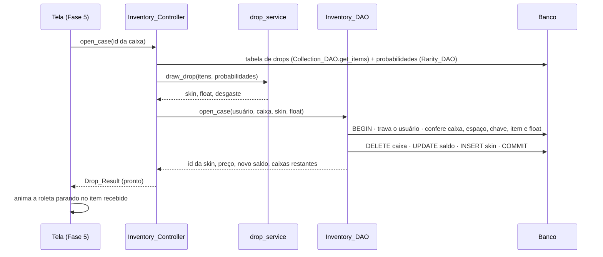
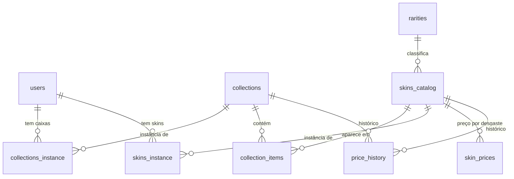

# CS Gacha — Roadmap v2 e Tutorial de Integração (Fases 2 e 3)

> Atualizado em **02/10/2026**. Substitui o roadmap de 01/10.
> Base: Documentação do Projeto, branch `refactoring` (commit `a6ca677 login and register working`) e as respostas às decisões D1–D6.
> **Como usar:** siga as seções 7 e 8 na ordem. Cada tarefa tem **Passos**, **Validação** (só marque `[x]` quando passar) e **Se der erro**. A seção 9 explica o código para você conseguir apresentar.

---

## Sumário

1. [Onde estamos](#1-onde-estamos)
2. [Decisões fechadas (D1–D9)](#2-decisões-fechadas-d1d9)
3. [Documentação × Projeto](#3-documentação--projeto-matriz-atualizada)
4. [Arquitetura](#4-arquitetura)
5. [O que mudou no banco (v1 → v2)](#5-o-que-mudou-no-banco-v1--v2)
6. [Arquivos entregues](#6-arquivos-entregues)
7. [Tutorial — Fase 2 (dados reais no banco)](#7-tutorial--fase-2-dados-reais-no-banco)
8. [Tutorial — Fase 3 (backend do gacha + nova tela de login)](#8-tutorial--fase-3-backend-do-gacha--nova-tela-de-login)
9. [Entendendo o código (para a apresentação)](#9-entendendo-o-código-para-a-apresentação)
10. [Fases 4 a 6 (próximos passos)](#10-fases-4-a-6-próximos-passos)
11. [Calendário](#11-calendário)
12. [PC do professor](#12-pc-do-professor)
13. [Riscos e plano B](#13-riscos-e-plano-b)
14. [Solução de problemas](#14-solução-de-problemas)
15. [Fontes](#15-fontes)

---

## 1. Onde estamos

| Fase | Conteúdo | Situação |
|---|---|---|
| 0 | Refatoração, ambiente | ✅ concluída (01/10) |
| 1 | Login e cadastro funcionando no banco | ✅ concluída (01/10) |
| 2 | Catálogo real (caixas, skins, raridades, floats) e preços reais no banco | 🟦 **código pronto**: integrar (seção 7, ~1 h) |
| 3 | Backend do gacha (sorteio, comprar, abrir, vender, inventário) + nova tela de login | 🟦 **código pronto**: integrar e validar (seção 8, ~1 h) |
| 4 | Tela do Mercado (caixas e skins avulsas) | ⏳ próxima |
| 5 | Inventário real, abertura com roleta, venda, detalhes | ⏳ |
| 6 | Testes de aceite, documentação, apresentação | ⏳ |

**Como o código das Fases 2 e 3 foi validado antes de chegar até você:**

- **58 testes automáticos** (regras, sorteio, controllers, importador e login) passando.
- **Simulação de 200.000 aberturas:** cada raridade ficou a menos de 0,07 ponto percentual da chance oficial, e a distribuição de desgaste saiu em 3/24/33/24/16%.
- **Fluxo completo dos DAOs** rodado num banco de conferência gerado a partir do `schema.sql`: comprar, abrir, vender, comprar skin, preço que mudou, saldo insuficiente, inventário em 1.000, skin de outro jogador, rollback sem consumir a caixa e conexões sempre fechadas. 45 de 45 verificações passaram.
- **Importador** rodado de ponta a ponta com respostas de API simuladas (30 de 30), incluindo uma execução com a API de preços fora do ar.
- **Tela de login** comparada com o seu mockup (prévia com as mesmas medidas e fontes) e a lógica dela exercitada com um Panda3D simulado (30 de 30).

> **O que eu NÃO consegui testar aqui** (meu ambiente não tem internet para pacotes nem MariaDB): a **janela real** do Panda3D, o **MariaDB do XAMPP** e as **APIs reais**. Por isso existem a tarefa **T3.2** (autoteste no seu banco) e a **T3.3** (checklist visual do login). Se algo falhar, copie a mensagem inteira e me mande.

---

## 2. Decisões fechadas (D1–D9)

Cada regra de jogo é **uma constante** em `app/core/game_rules.py`. Para mudar, altere só a linha indicada.

| # | Decisão | Como ficou | Onde muda |
|---|---|---|---|
| **D1** | Drops iguais ao CS | 1) sorteia a **raridade** entre as que existem **naquela caixa**: 79,92% / 15,98% / 3,20% / 0,64% / 0,26% (facas e luvas). Se a caixa não tem alguma raridade, as chances das outras são redistribuídas proporcionalmente. 2) sorteia a **skin**: dentro da raridade, todas têm chance igual. Uma mesma skin (ex.: as facas) pode estar em **várias caixas**: tabela `collection_items` (N:N). | probabilidades: tabela `rarities` |
| **D2** | Limite do inventário | **1.000 itens** (caixas + skins), o limite do CS. A compra é bloqueada com "Inventário cheio!". Abrir caixa continua permitido, porque sai 1 caixa e entra 1 skin (a regra do "−1" da documentação). | `INVENTORY_LIMIT` |
| **D3** | Mercado | Vende **caixas** e **skins avulsas**. Cada desgaste é um anúncio separado, como no mercado da Steam ("AK-47 \| Redline (Field-Tested)"). | — |
| **D4** | Preço real e volátil | Catálogo da **CSGO-API (ByMykel)** e preços **em R$** da **API pública da Skinport**, com média de vendas de 7 e 30 dias. Cada vez que o importador roda, os preços acompanham o mercado e entra uma linha em `price_history`. O jogo lê os preços **do banco**, então funciona **sem internet** na apresentação. Item sem preço na API recebe um **preço estimado** pela raridade e pelo desgaste. | `RARITY_BASE_PRICE`, `WEAR_PRICE_FACTOR` |
| **D5** | Float padrão do CS | Faixas oficiais: FN 0–0,07 · MW 0,07–0,15 · FT 0,15–0,38 · WW 0,38–0,45 · BS 0,45–1. Ao abrir uma caixa, o desgaste sai com **3% / 24% / 33% / 24% / 16%** (dados levantados pela comunidade; a Valve não publica a fórmula) e o valor é encaixado no float mínimo e máximo da skin. | `WEARS` |
| **D6** | Cortes | Fora do escopo: **EQUIPAMENTO, NOTÍCIAS, troca entre jogadores e gráficos avançados**. As armas padrão (do EQUIPAMENTO) continuam no catálogo como referência, mas **não entram mais no inventário** (no CS também não ocupam espaço). | — |
| **D7** (nova) | Chave para abrir caixa | No CS é preciso uma chave (US$ 2,49). Aqui custa **R$ 13,50**, cobrados na abertura. **Por quê:** sem a chave, abrir caixa dá lucro em média (o conteúdo vale mais que a caixa) e a economia quebra (persona José: "valor/custo consistente"). Para desligar: `Decimal("0.00")`. | `KEY_PRICE` |
| **D8** (nova) | Taxa de venda | **15%**, como a Steam. Uma skin de R$ 10,00 rende R$ 8,50. | `SELL_FEE_RATE` |
| **D9** (nova) | Login | O seu mockup tem o campo **"Usuário"**, então o login aceita **nome de usuário OU e-mail**: com "@" busca pelo e-mail, sem "@" busca pelo usuário. Por isso o nome de usuário não pode ter "@". | `Login_Controller.auth` |

**Moeda:** reais (R$), porque a Skinport já devolve os preços em BRL. Saldo inicial R$ 500,00 (como antes).

**Fora do escopo por enquanto (Won't):** StatTrak™ (10% de chance no CS) e Souvenir. Dá para adicionar depois sem mudar a estrutura.

---

## 3. Documentação × Projeto (matriz atualizada)

Legenda: ✅ pronto · 🟦 pronto no backend (falta a tela) · ⏳ falta

| História da documentação | Backend | Banco | Tela |
|---|---|---|---|
| Criar conta (nome, e-mail, senha; e-mail único) | ✅ | ✅ | ✅ (novo layout) |
| Login | ✅ (usuário ou e-mail) | ✅ | ✅ (novo layout) |
| Ver/editar dados | ✅ `User_Controller.update` | ✅ | ⏳ (Could) |
| Cálculo de probabilidade (backend) | ✅ `drop_service` | ✅ | — |
| Abrir caixa: valida caixa, espaço (−1), "inventário cheio!", não consome se der erro | ✅ `Inventory_DAO.open_case` | ✅ | ⏳ Fase 5 |
| Mostrar só o resultado no front / abrir outra / aceitar | ✅ `Drop_Result` (`can_open_another`) | — | ⏳ Fase 5 |
| Salvar caixas não abertas e itens novos | ✅ | ✅ | — |
| Acessar mercado / ver itens / detalhes | ✅ `Market_Controller` | ✅ | ⏳ Fase 4 |
| Comprar: preço verde/vermelho, saldo, espaço, confirmação | ✅ `can_afford`, `check_purchase`, `buy_case`, `buy_skin` | ✅ | ⏳ Fase 4 |
| Ver inventário / não mostrar itens de outros | ✅ `Inventory_Controller.load` | ✅ | ⏳ Fase 5 |
| Detalhes do item (float, nome, desgaste) | ✅ `Skin_Instance.wear_label` etc. | ✅ | ⏳ Fase 5 |
| Saldo atualizado e nunca negativo | ✅ (transação + `CHECK`) | ✅ | 🟦 header já mostra |
| Vender com valor final e confirmação | ✅ `sale_quote`, `sell_skin` | ✅ | ⏳ Fase 5 |
| "Valores reais" (persona Douglas) | ✅ importador + histórico | ✅ | ⏳ Fase 4 |

---

## 4. Arquitetura

```
┌────────────┐   chama    ┌──────────────┐  usa   ┌──────────────────┐   SQL   ┌────────┐
│   VIEW     │ ─────────▶ │  CONTROLLER  │ ─────▶ │       DAO        │ ──────▶ │ BANCO  │
│ (Panda3D)  │ ◀───────── │ (regra da    │ ◀───── │ (acesso ao banco)│ ◀────── │MariaDB │
│ só desenha │ resultado  │  tela)       │        └──────────────────┘         └────────┘
└────────────┘            └──────┬───────┘                                         ▲
                                 │ usa                                              │
                          ┌──────▼───────┐                              ┌──────────┴──────┐
                          │    CORE      │                              │ tools/          │
                          │ game_rules   │                              │ sync_market.py  │
                          │ drop_service │                              │ (API → banco)   │
                          └──────────────┘                              └─────────────────┘
```

- **View**: só desenha e lê o que o jogador digitou/clicou. Nunca calcula nada.
- **Controller**: recebe a ação da tela, chama o sorteio e os DAOs, trata erros e devolve mensagem ou resultado.
- **Core**: regras puras do jogo (sem banco e sem tela), fáceis de testar.
- **DAO**: todo o SQL. O `Inventory_DAO` faz as operações de dinheiro e itens em **transação**.
- **tools/sync_market.py**: roda fora do jogo e alimenta o banco com dados reais.

**Fluxo de uma abertura de caixa** (o que a documentação pede: cálculo no backend, o front só recebe o resultado):



---

## 5. O que mudou no banco (v1 → v2)

| Mudança | Por quê |
|---|---|
| Banco em `utf8mb4` e tabelas `InnoDB` | Nomes de skins têm "★" e "™"; `InnoDB` é necessário para transações e `FOR UPDATE` |
| `skins_catalog.collection_id` **removida** → tabela nova **`collection_items`** (caixa N:N skin) | No CS a mesma faca aparece em várias caixas; com 1:N teríamos de duplicar skins |
| `api_id` e `market_name` em `collections` e `skins_catalog` | Ligam nossos registros à API (importar de novo sem duplicar) e ao nome no mercado (buscar o preço) |
| `rarities.color` | Cor da raridade na interface (azul, roxo, rosa, vermelho, dourado) |
| Tabela **`skin_prices`** (preço atual por skin + desgaste, médias de 7 e 30 dias) | Cada desgaste tem preço diferente no mercado real |
| Tabela **`price_history`** | Histórico a cada atualização (variação, gráfico) |
| `collections.price_source` / `price_updated_at` | Saber se o preço é real (`skinport`) ou `estimado`, e de quando é |
| `acquired_at` nas instâncias | Ordenar o inventário do mais novo para o mais antigo (como no CS) |
| `CHECK (balance >= 0)` e `ON DELETE CASCADE` | O banco também impede saldo negativo; excluir a conta apaga os itens dela (antes dava erro de chave estrangeira) |
| Seed: armas padrão **fora** do inventário do usuário de teste | EQUIPAMENTO foi cortado; no CS as armas padrão não ocupam o inventário |



---

## 6. Arquivos entregues

O ZIP espelha a estrutura do projeto: é só extrair **por cima** da pasta do projeto.

| Arquivo | Situação | O que é |
|---|---|---|
| `main.py` | ALTERADO | + janela 1280×720, título e `textures-power-2 none` (sem isso as imagens ficam borradas) |
| `README.md` | REESCRITO | O antigo estava em UTF-16 (o GitHub mostrava "C S - G a c h a"); agora UTF-8, com a instalação |
| `ROADMAP.md` | REESCRITO | Este documento |
| `requirements.txt` | ALTERADO | + `brotli` (só para o importador) |
| `.gitignore` | ALTERADO | + `tools/cache/` |
| `app/migrations/schema.sql` | REESCRITO | Banco v2 (seção 5). **Apaga e recria o banco** |
| `app/migrations/seed_base.sql` | REESCRITO | Raridades com cor, usuário de teste, armas padrão |
| `app/core/paths.py` | NOVO | Caminhos das pastas em um lugar só |
| `app/core/game_rules.py` | NOVO | **Regras do jogo** (limite, chave, taxa, desgaste, preço estimado, formato R$) |
| `app/core/drop_service.py` | NOVO | **Sorteio**: tabela de drops, raridade, skin, float |
| `app/models/rarity.py` | NOVO | Raridade (nome, probabilidade, cor) |
| `app/models/collection.py` | NOVO | Caixa (nome, preço; `quantity` no inventário) |
| `app/models/skin_catalog.py` | NOVO | Ficha da skin (nome, raridade, float mínimo e máximo) |
| `app/models/skin_instance.py` | NOVO | Skin do jogador (float, desgaste, valor) |
| `app/models/market_price.py` | NOVO | Preço de mercado (atual, médias, variação de 7 dias) |
| `app/models/drop_result.py` | NOVO | Resultado da abertura entregue à tela |
| `app/models/user.py` | ALTERADO | Nome de usuário não pode ter "@" (D9) |
| `app/dao/base_dao.py` | ALTERADO | + `Base_DAO` (conexão, cursor `buffered`) e `Read_Only_DAO` (catálogo). `DAO` continua igual para o `User_DAO` |
| `app/dao/user_dao.py` | ALTERADO | + `get_by_username` |
| `app/dao/rarity_dao.py` | NOVO | Lê raridades e probabilidades |
| `app/dao/collection_dao.py` | NOVO | Caixas, conteúdo (tabela de drops) e histórico |
| `app/dao/skin_catalog_dao.py` | NOVO | Skins, preços por desgaste, anúncios do mercado (busca e paginação) e histórico |
| `app/dao/inventory_dao.py` | NOVO | **Transações**: comprar caixa, abrir, comprar skin, vender; listar o inventário |
| `app/controller/login_controller.py` | ALTERADO | Login por usuário ou e-mail; mensagens novas |
| `app/controller/market_controller.py` | NOVO | Regras da tela do Mercado |
| `app/controller/inventory_controller.py` | NOVO | Regras do Inventário (abrir, vender) |
| `app/view/login_register_view.py` | REESCRITO | Tela no layout do mockup (login + cadastro) |
| `app/assets/ui/*` | NOVO | Fundo, campos, botão (4 estados) e ícones |
| `app/assets/fonts/*` | NOVO | Fonte Inter (Regular e Bold) + licença OFL |
| `tools/sync_market.py` | NOVO | **Importador** da API |
| `app/unit_tests/test_user_flow.py` | ALTERADO | Login por usuário ou e-mail |
| `app/unit_tests/test_gacha_rules.py` | NOVO | Testes de regras e sorteio |
| `app/unit_tests/test_gacha_controllers.py` | NOVO | Testes dos controllers |
| `app/unit_tests/test_sync_market.py` | NOVO | Testes do importador |
| `app/unit_tests/manual_gacha_flow.py` | NOVO | **Autoteste no banco real** |
| `erro_main.txt` | **APAGAR** | Não é erro: é a mensagem normal do Panda3D ao iniciar |

Arquivos **não alterados**: `view_manager.py`, `user_controller.py`, `database.py` (o seu `use_pure=True` foi mantido), `password_utils.py`, `home_view.py`, `inventory_view.py`, `game_view_base.py`, `scene_backdrop.py`, `tools/arma_view.py`, `tools/mapa_view.py` e o protótipo.

---

## 7. Tutorial — Fase 2 (dados reais no banco)

### T2.1 Trazer os arquivos para o projeto (10 min)

**Passos**
1. Abra o terminal na pasta do projeto e confira que está tudo salvo:
   ```bat
   cd caminho\do\CS-Gacha
   git checkout refactoring
   git pull
   git status
   ```
   `git status` precisa dizer *nothing to commit, working tree clean*. Se não disser, faça commit do que tem antes.
2. Extraia o ZIP **por cima** da pasta do projeto: botão direito no `cs-gacha-fase2-3.zip` → **Extrair tudo...** → em *Destino*, **apague o final `\cs-gacha-fase2-3`** e deixe só a pasta do projeto (ex.: `C:\...\CS-Gacha`) → **Extrair** → **Substituir os arquivos no destino**. Por padrão o Windows cria uma subpasta, e aí os arquivos não entram no projeto. Depois de extrair, `main.py` e `README.md` devem estar na mesma pasta de antes, e não dentro de `cs-gacha-fase2-3\`.
3. Apague o log que foi para o Git por engano:
   ```bat
   git rm erro_main.txt
   ```
4. Veja o que mudou:
   ```bat
   git status
   ```

**Validação**
- [ ] `git status` mostra os arquivos da tabela da seção 6 (modificados e novos) e `erro_main.txt` como *deleted*.
- [ ] Existem as pastas `app/assets/ui` (12 arquivos) e `app/assets/fonts` (3 arquivos).

### T2.2 Instalar a dependência nova (2 min)

**Passos**
```bat
.venv\Scripts\activate
pip install -r requirements.txt
```

**Validação**
- [ ] `python -c "import brotli, panda3d, mysql.connector, dotenv; print('ok')"` imprime `ok`.

### T2.3 Recriar o banco na versão 2 (10 min)

> ⚠️ O `schema.sql` **apaga** o banco `csgacha` e cria de novo. As contas criadas nos testes de ontem somem (o usuário `testes` volta pelo seed).

**Passos (DBeaver)**
1. Ligue o MySQL no painel do XAMPP.
2. No DBeaver, conecte como `root`, abra `app/migrations/schema.sql` e execute **o script inteiro** com **Alt+X** ("Executar script"). Ctrl+Enter executa só uma linha.
3. Abra `app/migrations/seed_base.sql` e execute com **Alt+X**.
4. Se o DBeaver estiver em modo de *commit manual*, clique em **Commit**.

*Alternativa (phpMyAdmin):* aba **Importar** → escolha o arquivo → **Executar**. Se aparecer "DROP DATABASE statements are disabled", apague o banco antes em *Operações → Remover o banco de dados* e importe de novo.

**Validação** (rode no DBeaver):
```sql
use csgacha;
show tables;                                   -- 9 tabelas
select name, probability, color from rarities; -- 5 linhas; soma = 1.0000
select username, email, balance from users;    -- testes | teste@teste.com | 500.00
select count(*) from skins_catalog;            -- 34 (armas padrão)
select count(*) from skins_instance;           -- 0  (o inventário começa vazio)
```
- [ ] Tudo igual aos comentários acima.

**Se der erro:** "Access denied" no jogo depois disso → o usuário do `.env` perdeu a permissão. Rode como root:
```sql
grant all privileges on csgacha.* to 'csgacha_app'@'localhost';
flush privileges;
```
(troque `csgacha_app` pelo usuário do seu `.env`; se você usa `root` no `.env`, não precisa).

### T2.4 Importar caixas, skins e preços reais (10 min)

**Passos**
1. Veja os nomes das caixas disponíveis (opcional):
   ```bat
   python tools/sync_market.py --listar
   ```
2. Importe as caixas padrão **com as imagens**:
   ```bat
   python tools/sync_market.py --imagens
   ```
   As caixas padrão são: *CS:GO Weapon Case, Chroma Case, Glove Case, Fracture Case, Dreams & Nightmares Case, Kilowatt Case*. Para trocar, edite a lista `CAIXAS_PADRAO` no topo de `tools/sync_market.py` ou use `--caixas "Nome 1" "Nome 2"`.

**O que você vai ver** (os números variam):
```
1/4 Baixando catálogo (CSGO-API)...
2/4 Gravando 6 caixas e 4xx skins no banco...
3/4 Baixando preços em R$ (Skinport)...
    skins: 1xxx preços reais | xx estimados | 0 mantidos | caixas com preço real: 6
4/4 Baixando imagens (pode demorar alguns minutos)...
Resumo do conteúdo importado:
  Chroma Case: xx itens (Mil-Spec Grade: x, Restricted: x, Classified: x, Covert: x, Special Item: xx)
  ...
Pronto!
```

**Validação** (DBeaver):
```sql
-- 1) caixas, preço e quantidade de itens
select c.name, c.price_collection, c.price_source, count(ci.skin_catalog_id) as itens
from collections c left join collection_items ci on ci.collection_id = c.id
group by c.id, c.name, c.price_collection, c.price_source;

-- 2) quantos itens de cada raridade numa caixa
select r.name, count(*) as itens
from collection_items ci
join skins_catalog s on s.id = ci.skin_catalog_id
join rarities r on r.id = s.rarity_id
where ci.collection_id = (select id from collections where name = 'Chroma Case')
group by r.name;

-- 3) origem dos preços (a maioria deve ser 'skinport')
select source, count(*) from skin_prices group by source;

-- 4) histórico gravado nesta execução
select count(*) from price_history;
```
- [ ] 6 caixas, todas com itens e `price_source = skinport`.
- [ ] A consulta 2 mostra as 5 raridades (ou menos, se a caixa não tiver alguma).
- [ ] A consulta 3 mostra principalmente `skinport`.
- [ ] A pasta `app/assets/items` ficou cheia de imagens `.png`.
- [ ] Rodar o importador **de novo** não duplica nada (repita a consulta 1) e o `price_history` cresce.

**Se der erro:** veja a seção 14 (sem internet, limite da API, brotli).

### T2.5 Commit (2 min)

```bat
git add -A
git commit -m "Fase 2: banco v2, catalogo e precos reais via API, importador"
git push
```
- [ ] Push sem erro. As imagens de `app/assets/items` vão juntas: assim o PC do professor não precisa baixá-las.

---

## 8. Tutorial — Fase 3 (backend do gacha + nova tela de login)

### T3.1 Testes automáticos (2 min)

**Passos** (na raiz do projeto, com o `.venv` ativo):
```bat
python -m unittest app.unit_tests.test_user_flow app.unit_tests.test_gacha_rules app.unit_tests.test_gacha_controllers app.unit_tests.test_sync_market
```
**Validação**
- [ ] Termina com `Ran 58 tests` e `OK`.

### T3.2 Autoteste no banco real (3 min)

**Passos**
```bat
python -m app.unit_tests.manual_gacha_flow
```
O script cria um usuário temporário, compra uma caixa, abre, vende, compra uma skin avulsa e testa saldo insuficiente, chave e inventário cheio. Depois mostra **10.000 sorteios simulados** comparados com as chances oficiais e apaga o usuário temporário.

**Validação**
- [ ] Última linha: `TUDO CERTO: 31 verificações passaram.` (o número pode variar um pouco).
- [ ] A tabela "esperado × obtido" mostra valores próximos. **Guarde um print para a apresentação.**
- [ ] `select username from users;` mostra só as contas reais (o `autoteste_...` sumiu).

**Se der erro:** mande a saída **inteira**. A lista "FALHARAM" diz exatamente qual regra quebrou.

### T3.3 Conferir a nova tela de login (5 min)

**Passos**
```bat
python main.py
```
**Validação** (marque cada um):
- [ ] Janela 1280×720 com o fundo da arte, nítido, e o formulário embaixo do logo, igual ao mockup.
- [ ] O cursor já começa no campo **Usuário**, com borda laranja.
- [ ] Os textos de exemplo "Usuário" e "Senha" somem ao digitar e voltam ao apagar.
- [ ] **TAB** passa para o próximo campo; **Shift+TAB** volta.
- [ ] O **olho** mostra e esconde a senha.
- [ ] O botão **ENTRAR** muda de cor ao passar o mouse e ao clicar.
- [ ] Entrar com `testes` / `teste123` vai para a Home e mostra o saldo. Entrar com `teste@teste.com` também funciona.
- [ ] Senha errada mostra **"Usuário ou senha inválidos."** em vermelho.
- [ ] **Registrar** mostra 3 campos (Usuário, E-mail, Senha) e o botão **CADASTRAR**.
- [ ] Cadastro com senha curta mostra o erro; cadastro válido volta ao login com o usuário preenchido e a mensagem verde.
- [ ] Redimensionar ou maximizar a janela mantém o formulário alinhado ao logo.
- [ ] **SAIR** na Home volta ao login.

**Se algo estiver diferente:** tire um print e mande junto com o que apareceu no terminal (avisos começando com `WARNING` dizem qual imagem ou fonte não carregou).

### T3.4 Commit e tag (2 min)

```bat
git add -A
git commit -m "Fase 3: drop, transacoes de compra/abertura/venda, controllers e nova tela de login"
git push
git tag marco-3-backend
git push --tags
```
- [ ] Push sem erro.

---

## 9. Entendendo o código (para a apresentação)

### 9.1 O sorteio (`app/core/drop_service.py`)

1. **Tabela de drops**: `Collection_DAO.get_items(id)` traz todas as skins da caixa com a raridade de cada uma, que é a "tabela [item : probabilidade]" da documentação. `drop_table()` mostra a chance real de cada item.
2. **Raridade**: `draw_rarity()` usa `random.choices(raridades, weights=probabilidades)`. Os pesos são relativos, então se a caixa não tem alguma raridade as outras são redistribuídas sozinhas.
3. **Skin**: `random.choice()` entre as skins da raridade sorteada, com chance igual para todas.
4. **Float**: `draw_float()` sorteia a faixa (3/24/33/24/16%), um valor dentro dela de 0 a 1 e encaixa: `mínimo + valor × (máximo − mínimo)`.

Exemplo para explicar: numa caixa com 2 skins Covert, cada uma tem 0,64% ÷ 2 = **0,32%**.

### 9.2 Por que transação (`app/dao/inventory_dao.py`)

Abrir uma caixa mexe em 3 tabelas: apaga a caixa, desconta a chave e insere a skin. Se o programa caísse no meio, sem transação o jogador perderia a caixa sem ganhar a skin. Com transação, ou **tudo** é salvo (`commit`) ou **nada** (`rollback`). `SELECT ... FOR UPDATE` trava a linha do jogador até o fim, então duas operações ao mesmo tempo não gastam o mesmo dinheiro.

### 9.3 Por que `Decimal` e não `float`

`0.1 + 0.2` em `float` dá `0.30000000000000004`. Dinheiro e float da skin usam `Decimal`, igual ao `DECIMAL(10,2)` do banco.

### 9.4 Como o preço é "real"

O `tools/sync_market.py` busca na Skinport o preço sugerido de cada item, que é o mesmo nome do mercado da Steam ("AK-47 | Redline (Field-Tested)"), mais as médias de venda de 7 e 30 dias, e grava no banco. O jogo só lê o banco: rápido e sem depender de internet. Cada execução gera uma linha nova de histórico.

### 9.5 Perguntas prováveis da banca

| Pergunta | Resposta curta |
|---|---|
| Por que DAO? | Separa o SQL do resto. Se trocar de banco, só os DAOs mudam. |
| Como impede saldo negativo? | Três camadas: o controller confere, o DAO confere dentro da transação e o banco tem `CHECK (balance >= 0)`. |
| E se der erro no meio da abertura? | `rollback`: a caixa não é consumida (regra da documentação). Testado no autoteste. |
| O sorteio é justo? | Mesmas chances oficiais do CS. Mostre a tabela esperado × obtido do autoteste. |
| A tela calcula alguma coisa? | Não. A tela recebe um `Drop_Result` pronto e só anima. |
| Como a senha é guardada? | Hash SHA-256 com *salt* aleatório; a senha nunca fica salva em texto. |
| De onde vêm as skins? | CSGO-API (dados do jogo) e Skinport (preços), importados pelo `sync_market.py`. |
| E sem internet? | O jogo funciona: os dados já estão no banco. |

---

## 10. Fases 4 a 6 (próximos passos)

O backend dessas fases **já está pronto**: as telas só chamam os métodos abaixo. Eu monto o código das telas com você nas próximas sessões; seu trabalho será integrar e validar como fez hoje.

### Fase 4 — Tela do Mercado (`MarketView`, rota `"shop"`: o botão LOJA aparece sozinho no header)

| Tarefa | Métodos do backend | Validação |
|---|---|---|
| T4.1 Aba **CAIXAS**: grade com imagem (`item_image_path(api_id)`), nome e preço **verde/vermelho** | `list_cases()`, `can_afford(preço)` | Preço vermelho quando saldo < preço |
| T4.2 Clicar numa caixa: painel com o **conteúdo e a chance** de cada item | `case_contents(id)` | As chances somam 100% |
| T4.3 Comprar caixa: checagem → **"Deseja comprar por R$ X?"** → compra | `check_purchase(preço)`, `buy_case(caixa)` | Saldo do header atualiza; "Inventário cheio!" aparece |
| T4.4 Aba **SKINS**: busca, paginação, desgaste, preço e variação de 7 dias (▲▼) | `list_skins(busca, página)`, `Market_Price.variation_7d` | Busca "AK" filtra |
| T4.5 Comprar skin avulsa (com confirmação) | `buy_skin(skin, anuncio)` | Skin aparece no inventário com o desgaste certo |
| T4.6 *(Could)* Gráfico simples do histórico | `price_history(...)` | — |

### Fase 5 — Inventário, abertura e venda

| Tarefa | Métodos | Validação |
|---|---|---|
| T5.1 Inventário real (caixas agrupadas "x3" + skins) e contador "37/1000" | `load()`, `status()` | Mostra só os itens do jogador |
| T5.2 Clicar na skin: destaque + botão **DETALHES** → pop-up (nome, float, desgaste, valor, fechar) | `Skin_Instance.float_value`, `wear_label`, `skin_price` | Pop-up fecha |
| T5.3 **Vender**: valor final → confirmação → venda | `sale_quote(id)`, `sell_skin(id)` | Item some e saldo sobe |
| T5.4 **Abrir caixa** com a roleta do protótipo (`prototypes/roleta_prototype.py`): chama `open_case` **antes** e monta a roleta parando no item recebido; cor por raridade (`rarity.color_rgba`) | `open_case(id)` → `Drop_Result` | Botões **ACEITAR** e **ABRIR OUTRA** (só se `can_open_another`) |

Filtros do inventário: sugiro trocar as 7 categorias atuais por **TUDO / CAIXAS / SKINS** (as outras eram do escopo cortado).

### Fase 6 — Fechamento
- [ ] Roteiro de aceite (abaixo) rodado do zero num banco limpo.
- [ ] Prints, diagrama ER e de sequência (seções 4 e 5) nos slides.
- [ ] Vídeo da demo gravado (plano B).

**Roteiro de aceite:** cadastrar → login → R$ 500,00 → comprar caixa → abrir (roleta) → ver o item no inventário → detalhes → vender → saldo confere → fechar e abrir o jogo de novo → tudo persistiu.

---

## 11. Calendário

| Dia | Foco | Entregável |
|---|---|---|
| **Sex 02/10** | Instalação no PC do professor (versão da Fase 1) · integrar Fases 2 e 3 (seções 7 e 8) | Banco v2 com dados reais; 58 testes OK; autoteste OK; login novo |
| **Sáb 03/10** | Fase 4 (Mercado) | Comprar caixa e skin pela tela |
| **Dom 04/10** | Fase 5 (Inventário, abertura, venda) | **MVP completo** |
| **Seg–Qua 05–07/10** | Ajustes, *Should*, Fase 6 (slides, roteiro, vídeo) | Apresentação pronta |
| **Qui 08/10** | **Congelar o código** · atualizar o PC do professor (seção 12.2) · ensaiar | Nada de código novo |
| **Sex 09/10** | Apresentação | — |

**Se o tempo apertar, corte nesta ordem:** gráfico de histórico → aba de skins avulsas → pop-up de detalhes → cenário 3D. **Nunca corte:** comprar caixa, abrir com animação, vender.

---

## 12. PC do professor

### 12.1 Hoje (02/10): instalar a versão da Fase 1
Use o que já está no GitHub (`refactoring`), do mesmo jeito que você instalou no seu PC ontem (XAMPP + DBeaver + `.venv` + `pip install -r requirements.txt` + `.env` + `schema.sql` + `seed_base.sql`). O objetivo hoje é garantir que **Python, Panda3D, XAMPP e o Git funcionam lá**. A Fase 2 entra na quinta.

- [ ] `python main.py` abre e o login funciona no PC do professor.
- [ ] Anote: versão do Python, se há internet e se você tem permissão de administrador.

### 12.2 Quinta (08/10): atualizar para a versão final
```bat
git pull
.venv\Scripts\activate
pip install -r requirements.txt
```
Depois recrie o banco (`schema.sql` + `seed_base.sql`, como na T2.3) e escolha **uma** das opções:

- **Com internet lá:** `python tools/sync_market.py` (as imagens já vêm pelo Git).
- **Sem internet lá:** exporte o banco do **seu** PC e importe no dele (use o **cmd**, não o PowerShell, por causa do `<`):
  ```bat
  :: no SEU PC
  C:\xampp\mysql\bin\mysqldump -u root -p --databases csgacha > csgacha.sql
  :: no PC do PROFESSOR (copie o csgacha.sql por pendrive)
  C:\xampp\mysql\bin\mysql -u root -p < csgacha.sql
  ```
- [ ] Rode o autoteste (T3.2) e o roteiro de aceite **no PC do professor**.

---

## 13. Riscos e plano B

| Risco | Plano |
|---|---|
| Internet ou API fora do ar no dia | O jogo não usa internet. O importador usa a cópia em `tools/cache` e mantém os preços anteriores. |
| PC do professor com problema | Apresentar do seu notebook e levar o **vídeo da demo**. |
| `de_mirage_d.glb` (103 MB) | O GitHub recusa arquivos acima de 100 MB, por isso ele está no `.gitignore`. Leve por pendrive ou Drive. O cenário 3D é opcional: sem o arquivo o jogo funciona e só avisa no terminal. |
| Bug de última hora | Congelar na quinta; `git tag` em cada marco permite voltar (`git checkout marco-3-backend`). |

---

## 14. Solução de problemas

| Mensagem | Causa | O que fazer |
|---|---|---|
| `Unknown column 'api_id'` / `Table 'csgacha.collection_items' doesn't exist` | Banco ainda na versão 1 | Rode `schema.sql` + `seed_base.sql` (T2.3) |
| "Esta caixa não tem itens cadastrados. Rode o importador..." | Importador não rodou | `python tools/sync_market.py` |
| Importador: "biblioteca brotli não instalada" | Falta o `brotli` | `pip install brotli` |
| Importador: "limite de chamadas da API; aguarde 5 minutos" | A Skinport permite 8 chamadas a cada 5 minutos | Espere 5 minutos e rode de novo (o catálogo já foi salvo) |
| Importador: "Não foi possível baixar ... e não há cópia local" | Sem internet na primeira execução | Rode num PC com internet ou use a opção de exportar o banco (12.2) |
| Importador: "Caixa 'X' não encontrada. Você quis dizer: ...?" | Nome digitado diferente | Use o nome sugerido ou `--listar` |
| `Access denied for user` | Permissão do usuário do `.env` | `GRANT` da T2.3 |
| `Configuração do banco não encontrada` | Falta o `.env` | `copy .env.example .env` e preencha |
| Login com imagens borradas | `main.py` antigo | Confirme a linha `textures-power-2 none` |
| `WARNING ... Fonte não carregada` | Falta `app/assets/fonts` | Extraia o ZIP de novo (a tela funciona com a fonte padrão) |
| `WARNING ... Imagem não encontrada` | Falta `app/assets/ui` | Idem |
| "Saldo insuficiente para a chave (R$ 13,50)" | Regra D7 | Esperado; para desligar, `KEY_PRICE = Decimal("0.00")` |

---

## 15. Fontes

- Chances oficiais por raridade, StatTrak e chave: [SteamDB — CS2 Case Opening Odds](https://steamdb.com/en/articles/cs2-case-opening-odds-explained)
- Faixas de float: [SteamDB — CS2 Float and Wear Guide](https://steamdb.com/en/articles/cs2-float-wear-guide)
- Distribuição de desgaste 3/24/33/24/16%: [case.oki.gg — Case Odds](https://case.oki.gg/case-odds)
- Limite de 1.000 itens no inventário: [Steam Community — discussão sobre o limite](https://steamcommunity.com/app/730/discussions/0/5251727781289261304/) e [csgoskins.gg — Storage Units](https://csgoskins.gg/updates/storage-units)
- Catálogo de caixas e skins: [CSGO-API (ByMykel)](https://github.com/ByMykel/CSGO-API)
- Preços e histórico: [Skinport API — Items](https://docs.skinport.com/items) e [Sales History](https://docs.skinport.com/sales/history)
- Preço da chave (US$ 2,50): [tradeit.gg — Preço da Chave CS2](https://tradeit.gg/blog/pt/preco-chave-cs2/)
